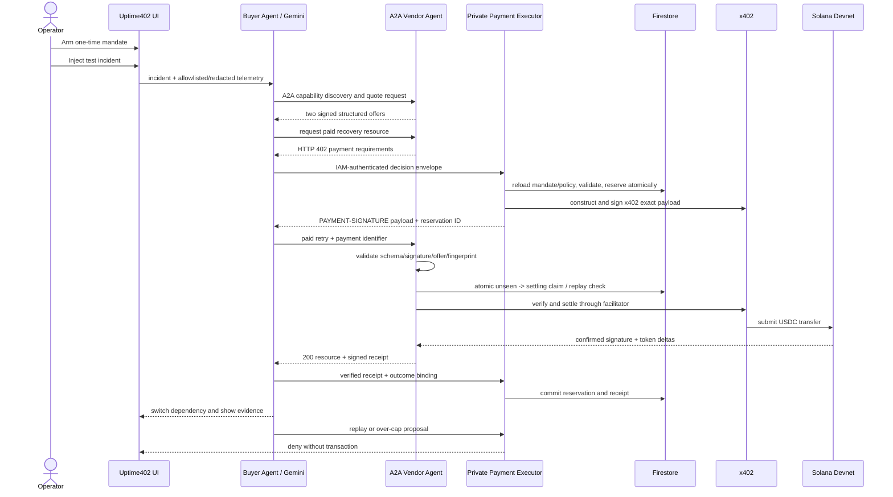

# Uptime402 architecture and contracts

## Contents

- [Preferred repository shape](#preferred-repository-shape)
- [Runtime flow](#runtime-flow)
- [Domain contracts](#domain-contracts)
- [Canonicalization and authenticity](#canonicalization-and-authenticity)
- [Policy evaluation order](#policy-evaluation-order)
- [Persistence states](#persistence-states)
- [Build status axes](#build-status-axes)
- [GCP deployment boundary](#gcp-deployment-boundary)
- [Untrusted input and network controls](#untrusted-input-and-network-controls)
- [Required tests](#required-tests)

## Preferred repository shape

Use one TypeScript workspace unless an existing repository dictates otherwise.

```text
apps/
  control-plane/       # Next.js UI, incident API, buyer orchestration
services/
  vendor-agent/        # Express A2A server and paid recovery resource
  payment-executor/    # private policy recheck, reservation, x402 payload signing
packages/
  domain/              # schemas and shared types
  policy/              # pure deterministic authorization and reservation logic
  payments/            # x402 client, signer adapter, signed receipts
  persistence/         # Firestore and in-memory adapters
docs/
artifacts/
```

Use three deployable services with distinct service accounts. A second vendor deployment is P1, but the one P0 vendor must expose at least two immutable offers so Gemini has a material selection to make.

## Runtime flow



## Domain contracts

Keep money as integer base units or decimal strings. Never use JavaScript floating point for authoritative amounts.

### Mandate

```ts
type Mandate = {
  id: string;
  subject: string;
  clusterLabel: 'devnet' | 'mainnet-beta';
  assetMint: string;
  perTransactionLimitBaseUnits: string;
  incidentLimitBaseUnits: string;
  dailyLimitBaseUnits: string;
  allowedRecipients: string[];
  allowedCapabilities: string[];
  allowedVendorOrigins: string[];
  allowedAgentCardHashes: string[];
  notBefore: string;
  expiresAt: string;
  revokedAt?: string;
  nonce: string;
  issuerPrincipal: string;
  issuedAt: string;
  executionPolicyHash: string;
  mandateHash: string;
  attestation: { kid: string; algorithm: 'EdDSA'; signature: string };
  protocolLabel: 'internal' | 'ap2-aligned' | 'ap2-validated';
};
```

Keep application, wire, and SDK network identifiers separate. Never emit an internal cluster label on the x402 wire.

```ts
type NetworkIdentity = {
  clusterLabel: 'devnet' | 'mainnet-beta';
  genesisHash: string;
  x402NetworkId: `solana:${string}`; // CAIP-2: first 32 base58 chars of full genesisHash
  sdkNetworkId: string;              // exact current SDK enum/string
};

type ExecutionPolicy = {
  id: string;
  version: number;
  network: NetworkIdentity;
  assetMint: string;
  assetDecimals: 6;
  executorPublicKey: string;
  feePayer: string;
  maxNetworkFeeLamports: string;
  allowedProgramIds: string[];
  allowedAccountRules: string[];
  allowedFacilitatorOrigins: string[];
  maxResponseBytes: number;
  policyHash: string;
};
```

At the time of this brief, Devnet RPC returns the full genesis hash `EtWTRABZaYq6iMfeYKouRu166VU2xqa1wcaWoxPkrZBG`; x402 v2 derives the CAIP-2 reference from its first 32 base58 characters, producing `solana:EtWTRABZaYq6iMfeYKouRu166VU2xqa1`. The current default Devnet USDC mint is `4zMMC9srt5Ri5X14GAgXhaHii3GnPAEERYPJgZJDncDU`. Keep the full RPC hash and the derived wire ID in separate fields, add a golden mapping test, and verify all values against current official docs, SDK exports, and live RPC before pinning them.

### Incident and offer

```ts
type Incident = {
  id: string;
  service: string;
  signal: string;
  observedAt: string;
  healthBefore: 'healthy' | 'degraded' | 'down';
  sanitizedTelemetry: {
    errorClass: string;
    statusCode?: number;
    latencyMs?: number;
    failureRate?: number;
    redactedMessage?: string;
  };
  redactionReportHash: string;
};

type VendorOffer = {
  offerId: string;
  providerAgentUrl: string;
  agentCardHash: string;
  offerHash: string;
  capability: string;
  resourceUrl: string;
  method: 'GET' | 'POST';
  priceBaseUnits: string;
  recipient: string;
  assetMint: string;
  x402NetworkId: `solana:${string}`;
  expiresAt: string;
  evidence: { latencyMs?: number; health?: string; description: string };
  signedOffer: { kid: string; signature: string };
};
```

### Model output

Use a strict schema. Reject extra fields if the SDK supports it.

```ts
type RecoveryDecision = {
  diagnosis: string;
  requiredCapability: string;
  selectedOfferId: string;
  rejectedOfferIds: string[];
  evidenceRefs: string[];
  rationale: string;
  confidence: number;
};
```

Gemini selects from supplied offer IDs; it may not invent a recipient, URL, amount, mint, or network.
Require at least two valid offers in the P0 decision set and a counterfactual test in which changed telemetry produces a different `selectedOfferId`. Treat vendor descriptions as untrusted data, never as model instructions.

### Payment proposal and evidence

```ts
type PaymentProposal = {
  incidentId: string;
  mandateId: string;
  offerId: string;
  operationId: string;
  executionPolicyHash: string;
  network: NetworkIdentity;
  method: 'GET' | 'POST';
  resourceUrl: string;
  canonicalBodyHash: string;
  requestFingerprint: string;
  recipient: string;
  assetMint: string;
  amountBaseUnits: string;
  challengeHash: string;
  paymentId: string;
  nonce: string;
  expiresAt: string;
  idempotencyKey: string;
};
```

The control plane sends this proposal as a decision envelope to the executor over a private Cloud Run route. Authenticate the caller with a Google-signed IAM ID token whose audience equals the executor URL. Include a canonical envelope hash and correlation ID; the executor must reload the offer, challenge, mandate, and policy from authoritative storage rather than trusting duplicated fields from Gemini or the browser.

### Fulfillment receipt

Prefer the official x402 Signed Offers & Receipts extension with a dedicated JWS `did:web` key after verifying current SVM compatibility. In addition, sign an application receipt that binds the paid operation to the delivered bytes and outcome:

```ts
type SignedEnvelope<T> = {
  payload: T;
  signer: string;
  keyId: string;
  signature: string;
};

type FulfillmentReceiptPayload = {
  version: '1';
  issuerAgentId: string;
  incidentId: string;
  offerId: string;
  paymentId: string;
  executionPolicyHash: string;
  challengeHash: string;
  requestFingerprint: string;
  txSignature: string;
  resourceResponseHash: string;
  resourceUrl: string;
  payer: string;
  payee: string;
  assetMint: string;
  amountBaseUnits: string;
  fulfilledAt: string;
};

type RecoveryOutcomePayload = {
  incidentId: string;
  paymentId: string;
  fulfillmentReceiptHash: string;
  resourceResponseHash: string;
  statusBefore: 'degraded' | 'down';
  statusAfter: 'healthy';
  healthProbeHash: string;
  recoveredAt: string;
};

type FulfillmentReceipt = SignedEnvelope<FulfillmentReceiptPayload>;
type RecoveryOutcomeEvent = SignedEnvelope<RecoveryOutcomePayload> & {
  artifactPath: string;
  artifactSha256: string;
};
```

Sign the RFC 8785 canonical `payload` using the vendor's dedicated key published through its `did:web` document or pinned Agent Card; `signer` is the Base58 public key and must differ from the USDC `payee`. The buyer verifies key authorization, signature, offer match, execution policy, request fingerprint, transaction, and response hash before committing the reservation. Hash the complete signed envelope to produce `fulfillmentReceiptHash`. The outcome occurs later, so avoid a circular/future hash in the vendor receipt: the control-plane-signed `RecoveryOutcomeEvent` points back to the immutable receipt hash and binds the response, health transition, probe artifact, and timestamp. The control-plane outcome key is pinned by the autonomy attestation and is separate from the payer wallet.

## Canonicalization and authenticity

Implement every canonicalizer once in the shared domain package and use the same functions in buyer, executor, vendor, tests, and evidence export. Pin golden test vectors.

- Canonical JSON: RFC 8785 JSON Canonicalization Scheme, UTF-8 bytes.
- Hash: SHA-256 lowercase hex with the `sha256:` prefix.
- Empty body: SHA-256 of zero bytes. JSON body: reject duplicate keys, schema-validate, then hash RFC 8785 bytes. Other allowed content types: hash the exact transmitted bytes.
- URL: parse with the WHATWG URL implementation; require `https` outside local tests; reject credentials and fragments; lowercase scheme/host; remove default ports; resolve dot segments; reject duplicate query keys; sort query pairs by key then value; preserve the normalized path/query bytes. Resolve only against a pinned vendor origin.
- `mandateHash`: canonical mandate excluding `mandateHash` and `attestation`.
- `executionPolicyHash`: canonical policy excluding `policyHash`.
- `agentCardHash` and `offerHash`: canonical, schema-validated documents excluding transport-only signatures as defined by their verifier.
- `challengeHash`: canonical decoded x402 `PaymentRequired` object after current official schema validation, not the raw header presentation.
- `requestFingerprint`: canonical object containing scheme, CAIP-2 network, asset mint, amount, payee, HTTP method, normalized URL, canonical body hash, operation ID, and payment ID.
- `responseHash`: exact response bytes after decompression policy is fixed; store content type and byte length beside it.

The executor attests a newly armed mandate only after authenticating the operator. The vendor signs offers and receipts with a key separate from the payment-receiving wallet. Never use a decorative hash: every stored hash must have a producer, a verifier, and at least one mutation test.

Persist each policy check as `{ rule, expected, actual, pass }`. A generic `approved: true` is not adequate evidence.

`artifacts/payment-evidence.json` must use schema version `2.0`. The normative field contract is [payment-evidence-v2.md](payment-evidence-v2.md), and the bundled checker is the machine-readable enforcement point. The repository's `evidence:verify` script must additionally verify RFC 8785 golden vectors, reject duplicate JSON keys, validate every signature, and emit a fresh nonce-bound `artifacts/verification-report.json`. Never commit placeholder evidence while labelling it confirmed.

## Policy evaluation order

Run all checks again immediately before signing:

1. mandate exists, is active, has correct subject, and is not revoked;
2. mandate attestation, `mandateHash`, immutable `executionPolicyHash`, issuer, and time window verify;
3. RPC genesis hash, application cluster label, x402 CAIP-2 network, and SDK network mapping all agree;
4. asset mint/decimals equal the pinned USDC configuration;
5. capability, Agent Card hash, vendor HTTPS origin, and recipient are allowlisted;
6. signed offer and 402 challenge are authentic, unexpired, and mutually consistent;
7. method, normalized URL, canonical request-body hash, operation ID, and request fingerprint match;
8. redirect is disabled or every hop is revalidated against the same pinned origin and public IP policy;
9. amount is positive, base-unit coherent, and within the per-transaction cap;
10. atomic reservation keeps incident and daily totals within cap;
11. payment ID, nonce, and idempotency key have not been consumed for another fingerprint;
12. transaction instructions/accounts/programs, fee payer, executor public key, and maximum fee match `ExecutionPolicy`;
13. the signer secret is available only inside the private payment executor and the active wallet matches `executorPublicKey`.

On any failure, emit a denial record and no transaction.

## Persistence states

Use a reservation state machine:

`proposed -> reserved -> submitted -> confirmed -> fulfilled -> committed`

Terminal alternatives:

- `denied`: policy failed before reserve;
- `released`: payment failed conclusively and budget was returned;
- `unknown`: submission outcome cannot be proven; keep budget reserved and reconcile before retry;
- `refunded`: a verified reverse settlement occurred.

Never blindly retry a payment in `submitted` or `unknown`. Reconcile by idempotency key and transaction signature first.

Vendor fulfillment uses a second state machine keyed by `(vendorTenant, paymentId)` and binds the first fingerprint:

`unseen -> settling -> settlement_verified -> resource_generated -> receipt_signed`

Before the atomic claim, perform stateless schema, payment signature, signed-offer, and request-fingerprint validation so an invalid retry cannot squat an ID. Then acquire `unseen -> settling` with a Firestore transaction before calling settle or generating the paid resource. The same payment ID plus the same fingerprint returns the persisted response/receipt; the same ID with a different fingerprint returns `409`. Release only after a conclusively pre-submission failure. A stale/ambiguous `settling` record remains reserved and is reconciled against the facilitator and RPC, never settled blindly. An in-memory cache is insufficient across Cloud Run instances.

## Build status axes

Do not collapse environment, implementation state, deployment, verification, and priority into one label. Every integration row in `docs/BUILD_STATUS.md` uses:

- `implementation`: `planned | blocked | implemented`;
- `evidence`: `none | simulated | local | sandbox | devnet | mainnet`;
- `deployment`: `local | live`;
- `verification`: `unverified | verified` plus `lastVerifiedAt` and `evidenceRef`;
- `priority`: `P0 | P1`.

`devnet` means a real public Solana Devnet transaction independently checked by RPC/Explorer. `live` means a reachable deployed endpoint, not proof of blockchain settlement. Mainnet requires explicit user authorization. Show the evidence level beside every payment in the UI and docs.

## GCP deployment boundary

P0:

- `control-plane`: Cloud Run, public read/demo routes and protected mutation routes; Gemini and browser-facing orchestration, no signer secret access.
- `payment-executor`: private Cloud Run service; operator-authenticated mandate arming, policy reload/recheck, atomic reservation, and x402 payment-payload signing. Only its service account can read the Devnet executor key; invoke it with an audience-locked Cloud Run IAM token.
- `vendor-agent`: separate Cloud Run service and identity, Agent Card/A2A endpoint, two immutable offers, x402-gated resource, shared fulfillment claims, facilitator settlement, and dedicated receipt-signing key.
- Firestore: mandates, incidents, reservations, events, receipts.
- Secret Manager: version-pinned Devnet executor secret accessible only to the payment-executor identity; a separate vendor signing secret is accessible only to vendor-agent.
- Cloud Logging: JSON logs with shared correlation IDs.

Final evidence includes distinct service-account names in each deployment config, raw hash-bound `run.invoker` IAM exports for all three services, an unauthenticated 401/403 probe against the executor URL, and the raw Secret Manager IAM export. The control-plane identity is the executor's only service invoker, and only the executor identity among these three can access the version-pinned wallet secret. The vendor receipt key and control-plane recovery-outcome key are also distinct.

P1:

- separate `mandate-admin` service/identity for hard policy-administration versus execution separation;
- Pub/Sub incident topic and Eventarc delivery.
- Workflows orchestration for verification and receipts.
- BigQuery sink for audit analysis.
- Cloud KMS Ed25519 signer adapter after transaction-format tests.

Do not describe Google Cloud Blockchain RPC as a Solana RPC product; its documented support may differ and must be checked. Use a Solana Devnet RPC endpoint or a verified Solana provider.

## Untrusted input and network controls

- Redact bearer/API keys, cookies, email, customer/account IDs, IP addresses, query secrets, and raw payloads before telemetry reaches Gemini or Cloud Logging. Send an allowlisted schema, not raw incident logs, and retain a redaction report hash.
- Treat Agent Cards, offers, descriptions, paid responses, and A2A messages as adversarial data. Schema-validate with unknown fields rejected, keep vendor text out of system/tool instructions, allow only supplied `offerId` values, and HTML-escape rendered content.
- Require vendor, resource, facilitator, DID, and Agent Card URLs to match pinned HTTPS origins. Reject userinfo, fragments, nonstandard schemes, localhost, private/link-local/multicast ranges, `metadata.google.internal`, and `169.254.169.254`.
- Disable redirects for payment and Agent Card requests in P0. If redirects are later enabled, re-run origin, DNS/IP, method, body-hash, and payment-context validation on every hop.
- Enforce DNS/connect/read timeouts, response byte limits, allowed content types, and connect-time address checks. Use controlled egress or an SSRF-safe fetcher so a DNS rebinding cannot bypass the preflight resolver.
- Never let a vendor-supplied URL, prompt, price, recipient, network, or mint bypass the pinned Agent Card, signed offer, 402 challenge, mandate, and execution-policy equality checks.

## Required tests

- exact-cap allow and cap-plus-one deny;
- expired, revoked, wrong mint, wrong cluster, and wrong recipient deny;
- duplicate nonce and idempotency retry create one settlement;
- concurrent reservations cannot overspend;
- malformed or hallucinated Gemini output cannot reach the executor;
- at least two supplied offers are ranked, and counterfactual telemetry changes `selectedOfferId`;
- telemetry redaction removes seeded credentials/PII from model payloads and logs;
- prompt-injection text in a vendor description cannot change offer, recipient, policy, or tool arguments;
- vendor 402 fields cannot redirect payment context;
- Cloud Run IAM wrong caller/audience and tampered decision-envelope hash are rejected;
- SSRF targets, DNS rebinding, redirects, cross-origin URLs, oversized bodies, and unsupported content types are rejected;
- network mapping tests keep cluster label, RPC genesis hash, CAIP-2 ID, SDK ID, and mint coherent;
- provider timeout before submission releases the reservation;
- unknown submission state does not automatically repay;
- two concurrent paid retries routed to separate vendor instances settle and fulfill once; same payment ID with a different fingerprint returns 409;
- vendor-signed receipt verifies and binds offer, challenge, request, transaction, response, and incident; mutation of each field fails verification;
- paid response hash and health outcome bind to the incident and transaction;
- A2A Agent Card discovery and message smoke test;
- production build starts with no secrets in browser output.
