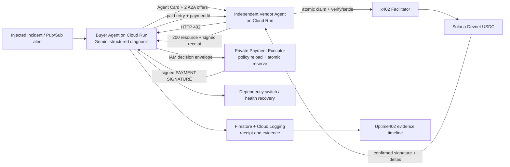

# Uptime402 finalist blueprint

## 최종 추천

**Uptime402 - 장애가 조달을 기다리지 않게.**

> Gemini 기반 AI SRE가 장애를 진단하고, 독립 공급자 에이전트에서 복구 API를 찾아 비교한 뒤, 사전에 위임된 한도 안에서 Solana USDC로 스스로 결제하고 실제 서비스 상태까지 복구하는 B2B 자율 조달·FinOps 제품.

타깃은 결제사, Web3 인프라, B2B SaaS의 SRE·플랫폼·FinOps 팀이다. 최초 사용 사례는 장애 중 백업 RPC·관측·보안·검색·진단 API를 요청 단위로 긴급 조달하는 것이다.

이 방향이 강한 이유는 한 번의 데모가 네 심사 항목을 모두 증명하기 때문이다.

- UX: 장애가 발생하면 사람이 결제창을 거치지 않고 복구 결과를 받는다.
- AI: Gemini가 텔레메트리를 해석하고 필요한 기능과 공급자를 선택한다.
- 기술: A2A 견적, x402(실제 경로에서 검증된 경우에만 pay.sh), Solana USDC, Cloud Run, Firestore가 하나의 인과관계로 연결된다.
- 실제 구동: `402 -> 정책 예약 -> 결제 payload 자동 서명 -> paid retry -> vendor/facilitator 정산 -> 200 -> 복구`를 트랜잭션과 로그로 검증한다.

## 공식 심사기준에서 역산

공식 최신 사이트와 인트로 덱에서 확인되는 심사기준은 아래 네 개이며 **배점은 공개되지 않았다**. 외부 재게시물의 5개 기준이나 Mainnet 필수 표기는 최신 공식 페이지와 다르므로 사용하지 않는다.

| 공식 기준 | 심사자가 10초 안에 볼 증거 | 구현 우선순위 |
|---|---|---:|
| 혁신성 및 UX | 장애 → 자율 구매 → 복구가 한 화면에서 끝나고, 한도 초과는 자동 차단 | P0 |
| AI 활용도 | Gemini의 구조화 진단·공급자 선택이 실제 도구 호출과 상태 변경을 일으킴 | P0 |
| 기술 완성도 및 인프라 연동 | A2A Agent Card, HTTP 402/재시도, USDC 정산, Cloud Run, Firestore | P0 |
| 실제 구동 여부 | Devnet 서명, Explorer, 수취인·금액·잔액, 영수증, 실행 이력 | P0 중 최우선 |

필수 제출물은 발표 PDF, 재현 가능한 GitHub/README, 3분 이내 데모 영상이다. 라이브 URL은 권장된다. 마감은 **2026-08-03 23:59 KST**, 파이널리스트 약 10팀 발표는 8월 7일, 데모데이는 8월 21일이다.

## 제품 선택 근거

| 후보 | AI·GCP 당위성 | Solana·x402 당위성 | 상업성·차별성 | 데모 위험 | 결론 |
|---|---|---|---|---|---|
| **Uptime402** | 장애 진단·도구 선택·복구에 필수 | 계정 없는 긴급 마이크로조달과 감사 영수증 | 결제사/SaaS가 즉시 이해, x402/선택적 pay.sh 위의 구매 통제층 | 중간 | **선택** |
| 범용 리서치 API 구매 | 충분 | 매우 높음 | 수평형이라 해자가 약함 | 낮음 | 장애 복구가 막힐 때 축소안 |
| 인보이스·AP 자동결제 | 충분 | 높음 | 기관 친화적이나 합성 데이터처럼 보이기 쉬움 | 중간 | 보류 |
| 여행 멀티에이전트 | 높음 | 보통 | 이미 대형 결제사가 실증, 예약·환불이 복잡 | 높음 | 제외 |
| 대규모 지원금 지급 | 보통 | 높음 | 공공성은 높으나 x402/pay.sh 연결이 약함 | 높음 | 제외 |

Uptime402는 A(Agent-Initiated Commerce), B(Autonomous On-chain Settlement), C(Multi-Agent Commerce)를 자연스럽게 결합한다. 트랙 수를 억지로 늘리는 것이 아니라 “긴급한 기계 구매”라는 한 문제 안에서 결합된다.

## 사용자 경험

### 최초 1회

운영자가 `10분 / 사고당 0.05 USDC / 건당 0.02 USDC / USDC만 / 허용 기능·수취인` 정책을 설정한다. 가능하면 Solana Fixed Delegation으로 금액·만료·취소 권한을 온체인에 둔다. x402 경로와 호환성이 검증되지 않으면, 제출본은 private payment-executor의 저잔액 wallet과 결정론적 application policy를 사용한다. 이는 blast-radius 격리이지 cryptographically scoped wallet이 아님을 명시한다.

### 이후 무승인 실행

1. 테스트 장애가 발생한다.
2. Gemini가 원인을 진단하고 필요한 복구 기능을 구조화 출력한다.
3. 구매 에이전트가 별도 Cloud Run의 공급자 Agent Card를 발견하고 A2A로 최소 두 개의 immutable 견적을 받는다.
4. 유료 리소스가 HTTP 402를 반환한다.
5. 정책 엔진이 네트워크, USDC mint, 수취인, 기능, 금액, 누적예산, 만료, nonce, 요청 해시를 검증하고 예산을 원자적으로 예약한다.
6. private payment-executor가 authoritative mandate/policy를 다시 읽고 IAM-authenticated envelope를 검증한 뒤 사람 승인 없이 x402 payment payload를 서명한다.
7. 결제 payload로 같은 요청을 재시도하면 vendor가 schema/signature/offer/fingerprint를 먼저 검증하고 paymentId를 `unseen -> settling`으로 원자 전환한 뒤 facilitator가 verify·settle한다. Confirmed 뒤에만 200 복구 리소스와 vendor-signed receipt를 반환한다.
8. 구매자가 receipt를 검증하고 실제 의존성을 전환하거나 건강검사를 통과시켜 상태를 빨간색에서 초록색으로 바꾼다.
9. 초과 견적 또는 재사용 nonce를 자동 거절해 “트랜잭션 없음”을 보여주고, counterfactual telemetry가 다른 offer를 선택하게 해 Gemini의 실질성을 증명한다.

핵심 문장: **무승인은 무제한이 아니다. 사람은 경계를 승인하고, 에이전트는 경계 안에서 실행한다.**

## 아키텍처

### P0 서비스

- `control-plane`: Next.js 기반 UI/API, redaction, Gemini 호출, A2A client, incident orchestration. Signer secret 없음.
- `payment-executor`: private Cloud Run, mandate arming, 정책 재검증·예약, x402 payload signing. 전용 identity만 key 접근.
- `vendor-agent`: Express 기반 별도 A2A server, Agent Card, 최소 두 offer, shared replay claim, x402-gated 복구 리소스, signed receipt.
- `domain/policy/payments/persistence` 패키지: 순수 스키마, 정책, 결제 어댑터, Firestore/in-memory 저장소.
- Cloud Run 3개 서비스, Firestore, Secret Manager, Cloud Logging.

### 공식 리소스의 전체 GCP 흐름

공식 리소스는 `Pub/Sub -> Eventarc -> Workflows -> payment verify -> Firestore state -> receipt/BigQuery -> agent response`를 권장한다. 다만 제출 전날에는 역할이 분리된 Cloud Run 3개와 Firestore를 P0로 만들고, Eventarc·Workflows·BigQuery는 실제 결제 경로가 안정된 뒤 추가한다. GKE는 이 범위에서 과하다.

### 프로토콜 선택

- x402 `exact`: 단일 복구 API 구매의 P0.
- x402 `upto`: 실행 뒤 사용량이 확정되는 단일 작업에만 P1.
- MPP `session`: 동일 건강 데이터의 반복 호출에만 P1.
- A2A: 별도 배포된 공급자 에이전트와 실제 통신할 때만 표기.
- AP2: 공식 schema/types로 검증하면 `AP2 validated`, 아니면 `AP2-aligned mandate`라고 표기.
- Solana Pay: 사용자 초기 위임·충전 UX에 실제 사용했을 때만 표기.
- pay.sh: 실제 CLI/SDK/gateway/catalog가 제출 transaction path에 참여했을 때만 표기.

## 결제 안전 설계

LLM과 payment executor를 서비스·identity 수준에서 분리한다. Gemini는 최소 두 개의 기존 `offerId` 중 하나를 추천할 뿐 URL, 수취인, 금액, mint, network를 만들 수 없다. raw telemetry는 credential·PII·customer ID를 제거한 allowlist schema만 모델/로그에 들어가고, A2A 문구는 prompt-injection-capable untrusted data로 취급한다.

서명 직전에 아래를 모두 재검증한다.

- mandate 활성·만료·취소 상태;
- RPC genesis hash, app cluster, x402 CAIP-2, SDK network mapping과 USDC mint;
- 허용 capability, pinned HTTPS vendor origin, Agent Card hash와 recipient;
- quote/challenge 가격·만료·상호 일치;
- HTTP method, 정규화 URL, canonical body hash;
- 건당·사고당·일일 한도와 현재 예약액;
- nonce와 idempotency key 미사용;
- 허용된 프로그램·계정·fee만 포함한 트랜잭션;
- execution policy의 executor public key, fee payer/limit, 허용 program/account와 실행 환경.

예산 상태는 `proposed -> reserved -> submitted -> confirmed -> fulfilled -> committed`로 관리한다. 제출 결과가 모호하면 `unknown`으로 두고 재결제하지 않는다. Vendor는 `(paymentId, requestFingerprint)` shared Firestore claim을 settle 전 원자적으로 잡아 두 instance replay도 한 번만 처리한다. Vendor-signed receipt는 offer·challenge·request·tx·response·incident를 bind하고 구매자가 서명과 identity를 검증한다. 모든 서비스는 같은 `incidentId`, `mandateId`, `paymentId`, `idempotencyKey`, `txSignature`를 로그에 남긴다.

Canonical JSON은 RFC 8785, hash는 SHA-256 `sha256:<hex>`로 고정하고 URL/body/request/mandate/policy/offer/challenge/receipt 규칙을 shared package와 golden vectors로 사용한다. Vendor·facilitator URL은 pinned HTTPS origin만 허용하고 redirect, private/link-local/metadata IP, oversized response, DNS rebinding을 차단한다.

## 한 화면 UX

암호화폐 거래소처럼 보이지 않는 다크 운영 콘솔을 권장한다.

- 상단: 서비스 health, active mandate, 남은 USDC, network, kill switch.
- 중앙: `incident -> Gemini -> A2A -> 402 -> policy/sign -> paid retry -> settle -> 200 -> recovery` 타임라인.
- 우측: 후보 견적과 Gemini 비교표.
- 하단/드로어: policy/IAM check, payer/payee token delta, mint, signature, Explorer, verified signed receipt.
- 마지막 카드: 성공 결과와 자동 거절 결과.

한국어 카피를 기본으로 하고 프로토콜명·코드는 영어를 유지한다. 심사위원이 펼치기 전에도 문제·결과·남은 예산이 보여야 한다.

## 3분 데모

목표 길이는 2분 45초다.

1. `0:00-0:15` - 장애와 고객 문제.
2. `0:15-0:30` - 한 번 설정된 mandate; 이후 손을 떼는 장면.
3. `0:30-0:50` - Gemini 구조화 진단.
4. `0:50-1:10` - A2A Agent Card와 두 견적.
5. `1:10-1:35` - 402, private executor 정책·자동 서명, paid retry, vendor/facilitator settle, 200.
6. `1:35-1:55` - 실제 USDC token delta·Explorer·signed receipt 검증.
7. `1:55-2:10` - 서비스 복구와 예산 차감.
8. `2:10-2:28` - 초과 또는 replay 자동 차단, 트랜잭션 없음.
9. `2:28-2:45` - 아키텍처·비즈니스 모델·Cloud Run URL.

결제마다 지갑 팝업이 뜨면 핵심 요건을 충족하지 못한다. 커서와 터미널을 함께 녹화해 숨은 승인 과정이 없음을 보여준다.

## 발표 PDF 9장

1. 한 줄 결과와 복구 전/후.
2. 타깃과 “장애 중 조달” 문제.
3. 기존 API 키·구독·카드가 에이전트에게 맞지 않는 이유.
4. 1회 위임 후 무승인 실행 플로우.
5. 실제 402/200·USDC·Explorer·거절 증거.
6. Gemini·A2A·x402(검증 시 pay.sh)·Solana·3개 Cloud Run 서비스 아키텍처.
7. 결정론적 정책·원자적 예산/fulfillment claim·private low-balance executor·signed receipt·kill switch.
8. 고객·수익모델·확장 시장.
9. 라이브 URL·GitHub·재현 명령·로드맵.

## 사업성

- Team: 월 구독 + 성공적으로 라우팅한 machine spend의 소액 비율.
- Enterprise: SSO/RBAC, 사내 vendor catalog, policy pack, 감사 보존, 규정준수 export의 연간 계약.
- 핵심 KPI: 정책을 준수하며 자율 복구된 사고 수.
- 보조 KPI: MTTR, 회피한 사람 승인, 사고당 비용, 정책 거절률, 공급자 성공률, standby 구독 대비 절감.

x402와 선택적으로 검증된 pay.sh는 결제·카탈로그 레일이고 Cloudflare Monetization Gateway는 판매자 측 과금 레이어다. Uptime402는 그 위에서 **무엇을 왜 살지 결정하고, 기업 정책으로 통제하며, 결과와 돈의 인과관계를 증명하는 구매자 측 control plane**이다.

## 제출 전날 실행순서

- H0-H3: 실제 Devnet 결제 spike와 `artifacts/payment-evidence.json`.
- H3-H6: private executor·정책/예약·vendor replay claim·거절 테스트.
- H6-H9: Gemini 두-offer 구조화 출력/counterfactual과 실제 A2A vendor.
- H9-H12: 한 화면 UI.
- H12-H15: Cloud Run/Firestore, 깨끗한 세션 검증.
- H15-H18: README, 발표 PDF, 영상.
- 나머지: 링크·재현·백업 endpoint QA.

늦어지면 BigQuery/KMS -> AP2 conformance -> 두 번째 vendor -> Eventarc/Workflows -> native delegation -> MPP -> passkey/gasless 순으로 자른다. 실제 결제, 정책, Gemini, A2A, 라이브 URL보다 시각 효과를 먼저 만들지 않는다.

## 치명적 리스크와 대응

| 리스크 | 대응 |
|---|---|
| pay CLI가 결제마다 생체승인을 요구 | CLI 데모에 의존하지 않고 private executor가 application policy 뒤에서 자동 서명 |
| sandbox가 공개 온체인이 아님 | 개발만 sandbox, 제출 증거는 Devnet signature와 Explorer |
| Devnet USDC·facilitator 불안정 | 처음 3시간에 spike, endpoint/지갑 백업, 결제 상태 `unknown` 처리 |
| Fixed Delegation과 x402 exact 호환 불명 | 호환성 검증 전에는 P1, P0는 private 저잔액 wallet + application-enforced policy로 정확히 표기 |
| A2A를 로컬 함수로 위장 | 별도 Cloud Run/프로세스와 공식 Agent Card smoke test |
| AP2 이름만 사용 | 공식 schema 통과 전에는 `AP2-aligned` |
| Gemini가 돈을 직접 결정 | 모델은 후보 ID 추천, 정책 코드가 승인·서명 |
| GCP 서비스를 그림에만 추가 | implementation/evidence/deployment/verification/priority 축을 분리한 상태표 유지 |
| Google Cloud Blockchain RPC를 Solana용으로 오인 | 공식 지원을 재확인하고 Solana Devnet RPC/검증된 공급자 사용 |
| 재시도 이중결제 | buyer reservation + vendor shared paymentId/fingerprint claim + facilitator/RPC reconciliation |
| wallet을 scoped라고 과장 | Fixed Delegation 전에는 application-enforced limits + low-balance blast-radius라고 표기 |
| telemetry/vendor prompt injection | model/log redaction, strict schema, supplied offer ID allowlist, output escaping |
| SSRF/context redirect | pinned HTTPS origin, redirect 금지, private/metadata IP와 DNS rebinding 차단 |

## 자료별 핵심 분석

- Hackathon Intro Deck: 네 심사기준, 필수 제출, 목업 제외, 실제 결제, 마감과 파이널리스트 일정.
- The Agentic Commerce Stack: 사람 부재 결제 정의, headless merchant, x402/MPP 차이, A2A·MCP·AP2·UCP 역할, 온체인 당위성과 guardrail 기회.
- Vibe Coding on Google Cloud: Skill을 SOP로 쓰는 방식, Gemini·Firestore·Cloud Run·pay.sh sandbox와 병렬 개발 패턴.
- Why Solana for Agentic Commerce: 실제 온체인·무승인·정책한도·Solana 스택·직관적 UX라는 명시적 기대, local/sandbox -> Devnet 순서.

원본 PDF는 portable harness에 포함하지 않는다. 파일별 provenance와 분석 노트는 `.agents/skills/ship-agentic-commerce-finalist/references/source-dossier.md`를 사용한다.

외부 공식 자료는 다음 결정을 보강한다.

- [공식 사이트](https://www.gcp-solana-ai-agentic-hacks-kr.xyz/)와 [리소스](https://www.gcp-solana-ai-agentic-hacks-kr.xyz/resources): 최신 네 심사축과 Devnet 인정.
- [pay.sh 공식 문서](https://pay.sh/docs)와 [TypeScript schemes](https://pay.sh/docs/sdk/typescript/schemes): exact/upto/session의 의미와 기본 승인 동작.
- [x402 문서](https://docs.x402.org/introduction), [network/token](https://docs.x402.org/core-concepts/network-and-token-support), [Payment Identifier](https://docs.x402.org/extensions/payment-identifier), [Signed Offers & Receipts](https://docs.x402.org/extensions/offer-receipt): 표준 402→signed retry→verify/settle→200 순서, CAIP-2, shared idempotency, signed delivery evidence.
- [Solana Subscriptions & Allowances](https://solana.com/news/subscriptions-and-allowances): AI agent spending limit에 맞는 Fixed/Recurring Delegation.
- [AP2 공식 발표](https://cloud.google.com/blog/products/ai-machine-learning/announcing-agents-to-payments-ap2-protocol)와 [공식 저장소](https://github.com/google-agentic-commerce/AP2): mandate와 검증 가능한 의도.
- [A2A 공식 SDK](https://github.com/a2aproject/a2a-js)와 [A2A-x402](https://github.com/google-agentic-commerce/a2a-x402): 독립 에이전트 발견·통신·결제 확장.
- [Gemini 모델 카탈로그](https://ai.google.dev/gemini-api/docs/models)와 [Cloud Run AI agents](https://cloud.google.com/run/docs/ai-agents): 구현 시점의 stable Flash 모델을 검증·pin하고 구조화 도구 사용과 배포를 증명.
- [Cloudflare Monetization Gateway](https://blog.cloudflare.com/monetization-gateway/): 요청 단위 기계 과금 시장의 실재와 판매자 측 비교군.
- [Solana Frontier 수상작](https://blog.colosseum.com/announcing-the-winners-of-the-solana-frontier-hackathon/): protocol 조립보다 명확한 startup wedge, 실행, 시장 통찰이 중요하다는 참고.

세부 구현 계약과 출처 목록은 `.agents/skills/ship-agentic-commerce-finalist/references/`에 고정되어 있다.
