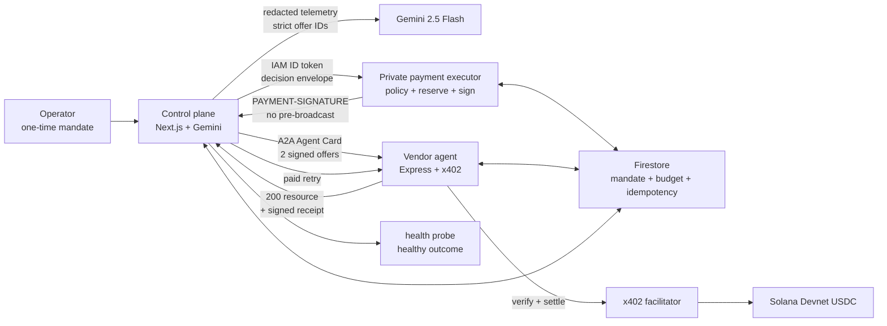

# Uptime402

> **An outage does not wait for procurement.**

Uptime402는 장애가 발생했을 때 Gemini 기반 AI SRE가 원인을 진단하고, A2A vendor agent의 복구 견적을 비교한 뒤, 운영자가 미리 설정한 정책과 예산 안에서 x402 + Solana USDC로 복구 리소스를 자동 구매하는 B2B agentic commerce 프로젝트입니다. 결제 건별 승인이나 브라우저 지갑 팝업 없이 실행되며, 결제와 실제 service recovery가 하나의 검증 가능한 증거 사슬로 남습니다.

이 저장소는 아이디어나 UI mockup이 아니라 **실제 Solana Devnet USDC 결제, Cloud Run 3-service boundary, Firestore transactional state, Gemini의 material decision, A2A discovery, signed fulfillment receipt, 자동 denial**까지 구현한 포트폴리오용 reference implementation입니다.

## 바로 보기

- [Live mission control](https://uptime402-control-plane-1065649463621.asia-northeast3.run.app) — 로그인 없는 `DEVNET VERIFIED` read-only replay
- [Demo video](https://www.youtube.com/watch?v=jwJRfs-NRZY) — 한국어 내레이션으로 전체 흐름 설명
- [Solana Explorer transaction](https://explorer.solana.com/tx/4P7YWm9Rt7w4MKbRvmfj3sjt5SW1NUfra7xyT9zUMD9uBsby4f3JC8LgYKUFPE1GXN24SoK8ABRx5YSf1HQAKtmZ?cluster=devnet)
- [Payment evidence](artifacts/payment-evidence.json) · [Verification report](artifacts/verification-report.json) · [Current portfolio release verification](artifacts/local/portfolio-release-verification.json)
- [Architecture](docs/ARCHITECTURE.md) · [Presentation deck](submission/Uptime402_Deck.pdf) · [Build status](docs/BUILD_STATUS.md)

## 검증된 결과

2026-08-03의 보존된 `finalist-demo-5` 실행에서 다음 결과를 확인했습니다.

| Signal | Verified result |
|---|---|
| Autonomous payment | 최초 mandate 설정 후 건별 승인 없이 `0.015 USDC` 자동 결제 |
| x402 round trip | `402 -> policy reserve -> automatic PAYMENT-SIGNATURE -> paid retry -> facilitator verify/settle -> confirmed 200` |
| On-chain settlement | Solana Devnet `finalized`, slot `480903755` |
| Token deltas | payer `-15000`, payee `+15000` base units; mint `4zMMC…DncDU` |
| Recovery | paid resource 적용 후 dependency health가 `healthy`로 전환 |
| Material Gemini decision | baseline은 `rpc-recovery-standard`, counterfactual telemetry는 `rpc-recovery-emergency` 선택 |
| Safety denials | `25000 > 20000` per-transaction limit과 nonce replay를 모두 자동 거절 |
| No-payment proof | 두 denial 모두 `transactionCreated:false`, `txSignature:null` |
| Delivery proof | vendor-signed receipt가 offer/request/transaction/response를 bind하고, 별도 control-plane signature가 healthy outcome을 bind |

Payment evidence SHA-256:

```text
0a7bfbb00b07ad29d0a74a4d28e5f8d443c94e6bd5034eeb6b7463463b332df4
```

Verification report SHA-256:

```text
b147e7cfe2c71fee903f4052ca342d8266343694e48843ae017c8e55ae42cd3e
```

공개 UI의 `final` stage는 이 두 파일과 exact hash를 함께 검증합니다. 어느 하나라도 없거나 다르면 `VERIFIED` 화면을 만들지 않고 fail closed합니다. 현재 root는 보존된 실행을 반복 재생할 뿐 새 incident나 결제를 생성하지 않습니다.

## 해결하려는 문제

장애는 수초 안에 시작되지만 외부 복구 도구의 구매 과정은 계정 생성, 계약, API key 발급, 카드 결제처럼 사람 중심으로 설계돼 있습니다. 미리 모든 backup provider를 구독하면 shelfware 비용이 생기고, 장애가 난 뒤 구매하면 복구가 늦어집니다.

Uptime402의 목표는 다음과 같습니다.

> 운영자가 정한 정책 경계 안에서 AI agent가 필요한 복구 API를 즉시 구매하고 사용해 서비스를 복구하며, 왜 그 판단과 결제가 허용됐는지 나중에 독립 검증할 수 있게 한다.

핵심 원칙은 **approval-free does not mean policy-free**입니다.

## 실제 실행 흐름

1. 운영자가 USDC asset, recipient, capability, expiry, incident cap과 per-transaction cap을 포함한 mandate를 한 번 arm합니다.
2. Control plane은 raw telemetry에서 credential, PII, customer identifier를 제거하고 allowlisted schema만 Gemini에 전달합니다.
3. Gemini는 vendor가 제공한 두 signed offer ID 중 하나만 strict schema로 선택합니다. 금액 계산, policy 변경, key 접근, transaction signing은 할 수 없습니다.
4. Buyer는 별도 Cloud Run vendor의 A2A Agent Card를 발견하고 immutable signed offers를 받습니다.
5. Paid recovery resource가 `PAYMENT-REQUIRED`와 함께 HTTP `402`를 반환합니다.
6. Private executor가 authoritative mandate, offer, challenge, network, mint, recipient, request fingerprint, nonce, budget을 다시 읽고 Firestore transaction으로 예산을 reserve합니다.
7. Executor는 x402 payment payload를 자동 서명해 control plane에 반환합니다. 이 시점에는 먼저 broadcast하지 않습니다.
8. Buyer가 같은 request를 `PAYMENT-SIGNATURE`와 함께 retry하고, vendor/facilitator가 verify와 settle을 수행합니다.
9. Confirmed settlement 뒤에만 vendor가 `200` recovery resource와 signed fulfillment receipt를 반환합니다.
10. Control plane은 receipt를 검증하고 resource를 적용한 뒤 health probe를 통과시키고 budget을 commit합니다.
11. 같은 operator action에서 over-cap과 nonce replay를 시도해 transaction 없이 거절되는지도 기록합니다.

## 아키텍처



세 Cloud Run service는 서로 다른 service account를 사용합니다.

| Service | Exposure | Responsibility | Secret boundary |
|---|---|---|---|
| `control-plane` | public read-only replay, protected mutation routes | redaction, Gemini/A2A orchestration, receipt verification, recovery outcome | outcome-signing key only |
| `payment-executor` | private IAM | authoritative policy recheck, atomic reservation, x402 payer signature | low-balance Devnet executor key only |
| `vendor-agent` | public A2A/resource endpoints | signed offers, 402 challenge, replay claim, facilitator settlement, fulfillment receipt | vendor offer/receipt key only |

Control plane, Gemini, browser에는 executor signer material이 없습니다. Executor는 signed payload만 반환하고, standard x402 순서에 따라 vendor/facilitator가 paid retry를 settle합니다.

## 설계에서 중요하게 다룬 문제

### AI 판단과 금전 권한 분리

Gemini는 정제된 장애 신호를 진단하고 이미 공급된 `offerId`를 비교합니다. Recipient, mint, network, amount, policy와 raw transaction은 결정론적 코드와 authoritative storage가 소유합니다. Counterfactual telemetry가 실제로 선택을 바꾸는 테스트로 AI가 장식이 아니라는 점을 검증합니다.

### 증거를 product surface로 취급

단순 transaction link만 남기지 않습니다. RFC 8785 canonical JSON과 `sha256:<lowercase hex>`를 공통 binding 규칙으로 사용하고, 402 challenge, request fingerprint, Solana transaction, response bytes, vendor receipt, recovery outcome을 연결합니다. UI는 이 증거를 시간순으로 재생합니다.

### 중복 결제와 모호한 상태 처리

Buyer reservation은 `proposed -> reserved -> submitted -> confirmed -> fulfilled -> committed` 상태를 사용합니다. Vendor claim은 `(vendorTenant, paymentId)` 기준으로 `unseen -> settling -> settlement_verified -> resource_generated -> receipt_signed`를 원자적으로 전환합니다. 같은 ID와 다른 fingerprint는 `409`, 모호한 `submitted`/`settling`은 자동 재결제하지 않고 reconcile 대상으로 남깁니다.

### 정책은 서명 직전에 다시 검증

Mandate active window, execution policy hash, CAIP-2 network, full genesis hash, USDC mint, recipient, signed offer/challenge, normalized URL, body hash, amount cap, remaining budget, nonce/idempotency, allowed programs/accounts와 executor public key를 다시 확인합니다. 첫 실패에서 deny하고 transaction absence를 evidence로 남깁니다.

## Repository map

```text
apps/control-plane/          Next.js mission-control UI and orchestration
services/vendor-agent/      Separate A2A server and x402-gated resource
services/payment-executor/  Private policy/reservation/signing service
packages/domain/            Zod schemas, canonicalization, hashes, URL rules
packages/policy/            Deterministic policy state machine
packages/payments/          x402/SVM adapters, signer and receipt verification
packages/persistence/       In-memory and Firestore transactional adapters
tests/                      Unit, integration, security and evidence tests
scripts/                    Operator, capture, verification and audit tooling
deploy/                     Cloud Build and three Cloud Run templates
artifacts/                  Promoted evidence and deployment/IAM attestations
docs/                       Architecture, build status and demo documentation
submission/                 Deck source/export; video is intentionally untracked
```

## Fresh clone

### Prerequisites

- Node.js 22+
- Corepack and pnpm `10.29.2`
- Python 3.11+
- Firebase CLI 11+ and JDK 17+ for Firestore Emulator tests
- Google Cloud SDK only for Cloud Run deployment/inspection

### Install and verify

```bash
git clone https://github.com/kwakhyun/uptime402-agentic-commerce.git
cd uptime402-agentic-commerce
corepack enable
pnpm install --frozen-lockfile
pnpm run lint
pnpm run typecheck
pnpm run test
pnpm run build
pnpm run audit:git
python3 deploy/render_cloudrun.py --check-templates
python3 .agents/skills/ship-agentic-commerce-finalist/scripts/check_finalist_readiness.py \
  --root . --strict
```

`pnpm run test`의 Firestore 전용 항목은 emulator가 없으면 skip됩니다. 실제 transaction/concurrency suite는 다음처럼 실행합니다.

```bash
NODE_BIN="$(command -v node)"
firebase emulators:exec --only firestore \
  "\"${NODE_BIN}\" node_modules/vitest/vitest.mjs run \
  tests/persistence-firestore.test.ts \
  tests/payment-authorization-firestore.test.ts \
  --reporter=verbose"
```

### 로컬 protocol flow

```bash
pnpm exec vitest run tests/services-integration.test.ts --reporter=verbose
```

이 integration test는 `402 -> reserve -> automatic payload signature -> paid retry -> verify/settle adapter -> confirmed 200 -> signed receipt`, over-cap denial, replay/idempotency, two-instance settle-once를 재현합니다. Facilitator와 chain은 명시적인 local adapter이므로 이 결과를 Devnet evidence라고 부르지 않습니다.

로컬 UI는 다음 명령으로 실행합니다.

```bash
pnpm run dev
```

`http://localhost:3000`의 fixture는 `local-simulated`입니다. Managed Firestore, live Gemini, vendor/executor Cloud Run 또는 Devnet transaction을 실행하거나 증명하지 않습니다.

## Evidence 확인

Tracked evidence bytes가 live final revision에 고정된 값과 같은지 확인합니다.

```bash
sha256sum artifacts/payment-evidence.json artifacts/verification-report.json
```

Expected output:

```text
0a7bfbb00b07ad29d0a74a4d28e5f8d443c94e6bd5034eeb6b7463463b332df4  artifacts/payment-evidence.json
b147e7cfe2c71fee903f4052ca342d8266343694e48843ae017c8e55ae42cd3e  artifacts/verification-report.json
```

`artifacts/payment-evidence.json`에는 CAIP-2 network, full genesis hash, USDC mint, integer base units, distinct payer/payee, 관련 token-account balance deltas, x402 headers, signed receipt, healthy outcome과 두 denial이 들어 있습니다. 민감한 signer material은 포함하지 않습니다.

Fresh full verification은 official Devnet RPC와 evidence가 선언한 local demo MP4를 요구하고 nonce-bound `verification-report.json`을 새로 씁니다. Canonical artifact를 보존하려면 disposable clone에서 실행해야 합니다. 자세한 promotion/verification 절차는 [deploy/README.md](deploy/README.md)와 [BUILD_STATUS.md](docs/BUILD_STATUS.md)를 참고하세요.

## Cloud Run deployment

Deployment renderer는 `capture`와 `final` 두 단계를 분리합니다.

- `capture`: evidence hash 없이 배포하며 UI는 항상 `LIVE UNVERIFIED`입니다.
- `final`: 실제 capture와 verifier가 끝난 뒤 immutable image에 evidence/report를 포함하고 두 SHA-256을 exact pin합니다.

```bash
python3 deploy/render_cloudrun.py --check-templates
python3 deploy/render_cloudrun.py \
  --env-file .env.deploy \
  --output-dir /private/tmp/uptime402-cloudrun
```

세 service account, `run.invoker`, version-pinned Secret Manager access와 raw IAM export 절차는 [deployment guide](deploy/README.md)에 있습니다. Control plane과 vendor만 public이며 executor의 unauthenticated request는 `401/403`이어야 합니다.

## Configuration and secrets

[`.env.example`](.env.example)은 설명만 담은 superset reference입니다. 그대로 source하지 말고 service별 ignored local env를 만드세요. Private key, wallet bytes, ID token, service-account key, `.env`, raw capture와 video는 Git에 포함하지 않습니다. Cloud Run에서는 Secret Manager numeric version과 최소권한 service account를 사용합니다.

P0의 wallet 보장은 **application-enforced policy plus low-balance blast-radius isolation**입니다. Native Fixed Delegation을 end-to-end로 검증하지 않았으므로 `scoped wallet`, cryptographic cap이라고 주장하지 않습니다.

## Security coverage

- integer base-unit money math and atomic budget reservation
- nonce, payment ID, idempotency key and request-fingerprint replay protection
- two-instance vendor settle/fulfill-once behavior
- IAM audience/caller and decision-envelope integrity checks
- SSRF, redirect, private/link-local/metadata IP, oversized body and content-type rejection
- telemetry/log/model redaction and prompt-injection isolation
- RFC 8785 golden vectors and field-mutation signature tests
- vendor receipt authority, control-plane outcome authority, payer and payee identity separation
- Secret Manager volume symlink containment and bounded JSON reads
- browser bundle/key boundary and Git secret audit

## 현재 한계와 다음 단계

- 실제 결제는 **Solana Devnet**에서만 수행했습니다. Mainnet payment는 실행하지 않습니다.
- 한 owned vendor deployment가 두 immutable offer를 제공합니다. 독립적인 두 번째 vendor는 후속 범위입니다.
- 별도 mandate-admin service가 아닌 operator-authenticated application-role separation입니다.
- Native Fixed Delegation, MPP, AP2 conformance, passkey, gasless, KMS, Pub/Sub/Eventarc/Workflows/BigQuery pipeline은 live path에 없습니다.
- `pay.sh` CLI/SDK/gateway/catalog를 live payment path에서 사용하지 않았으므로 pay.sh integration을 주장하지 않습니다.
- 공개 UI는 portfolio-safe read-only evidence replay입니다. 보호된 mutation route는 유지되지만 새 결제를 체험시키는 public sandbox는 아닙니다.
- 이 구현은 검증 가능한 기술 실험과 포트폴리오를 위한 것이며 production financial system으로 감사받지 않았습니다.

## Project context

Uptime402는 **Google Cloud x Solana AI Agentic Hackathon 2026** 기간에 설계·구현·제출했습니다. 전체 60개 팀 중 결선 10개 팀에는 선정되지 않았습니다. 이 결과와 별개로 실제 Devnet settlement, payment-to-resource delivery, deterministic denial, Gemini/A2A materiality, Cloud Run/Firestore/IAM boundary를 끝까지 구현한 기록을 보존하며 포트폴리오와 agentic commerce reference project로 계속 유지합니다.

프로젝트가 보여주는 핵심 역량은 특정 해커톤 순위가 아니라, 모호한 agent workflow를 strict contracts와 state machines로 분해하고 실제 외부 side effect를 보안 경계와 검증 가능한 evidence로 닫는 능력입니다.
