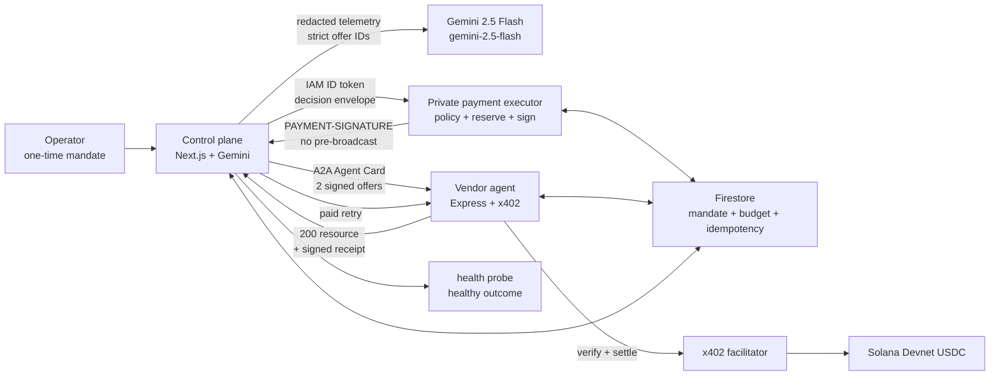

# Uptime402

> **An outage does not wait for procurement.**

Uptime402는 장애가 발생하면 Gemini로 원인을 진단하고, A2A로 받은 공급자 견적을 비교해 복구 리소스를 자동 구매하는 프로젝트입니다. 운영자가 미리 설정한 정책과 예산 안에서 x402와 Solana USDC로 결제하므로 건별 승인이나 브라우저 지갑 팝업이 필요하지 않습니다. 결제부터 리소스 전달, 라우트 활성화까지의 기록을 서로 연결해 검증할 수 있습니다.

이 저장소에는 **실제 Solana Devnet USDC 결제, 세 Cloud Run 서비스의 권한 분리, Firestore 트랜잭션, Gemini의 견적 선택, A2A 통신, 서명 영수증, 정책 위반 요청의 자동 거절**을 구현한 코드와 검증 기록이 있습니다. B2B 에이전트 간 자동 거래를 다룬 포트폴리오용 참고 구현입니다.

## 바로 보기

- [Live mission control](https://uptime402-control-plane-1065649463621.asia-northeast3.run.app) — 로그인 없이 검증된 실행 기록 재생
- [Demo video](https://www.youtube.com/watch?v=jwJRfs-NRZY) — 한국어 내레이션으로 전체 흐름 설명
- [Solana Explorer transaction](https://explorer.solana.com/tx/4P7YWm9Rt7w4MKbRvmfj3sjt5SW1NUfra7xyT9zUMD9uBsby4f3JC8LgYKUFPE1GXN24SoK8ABRx5YSf1HQAKtmZ?cluster=devnet)
- [Payment evidence](artifacts/payment-evidence.json) · [Verification report](artifacts/verification-report.json) · [Current replay deployment evidence](artifacts/portfolio-deployment/manifest.json)
- [Architecture](docs/ARCHITECTURE.md) · [Presentation deck](submission/Uptime402_Deck.pdf) · [Build status](docs/BUILD_STATUS.md)

2026-09-05 개선에서는 재결제 없이 후속 단계를 재개하는 기능, 동시 예약에도 정확한 예산 증거, 실제 RPC 상태 검사, 검증 범위를 명확히 보여주는 UI를 추가했습니다. 공개 화면 배포를 준비하고 있으며, 결제 실행 경로의 변경은 로컬에서 검증했습니다. 구현과 검증 결과는 [개선 기록](docs/REVIEW_2026-09-05.md#개선-반영-기록)을 참고하세요. 보존된 실행의 `9.340초`는 Gemini 판단 기록부터 라우트 활성화 확인까지의 구간이며 장애 발생부터의 총 복구 시간이 아닙니다.

## 검증된 결과

2026-08-03의 보존된 `finalist-demo-5` 실행에서 다음 결과를 확인했습니다.

| Signal | Verified result |
|---|---|
| Autonomous payment | 최초 결제 권한 설정 후 건별 승인 없이 `0.015 USDC` 자동 결제 |
| x402 round trip | `402 -> policy reserve -> automatic PAYMENT-SIGNATURE -> paid retry -> facilitator verify/settle -> confirmed 200` |
| On-chain settlement | Solana Devnet `finalized`, slot `480903755` |
| Token deltas | payer `-15000`, payee `+15000` base units; mint `4zMMC…DncDU` |
| Recovery | paid resource 적용 후 Firestore 라우트 활성화와 문서 무결성 확인; 실제 대체 RPC 성공은 당시 측정하지 않음 |
| Material Gemini decision | 기록된 장애 조건에서는 `rpc-recovery-standard`, 더 심한 장애 조건에서는 `rpc-recovery-emergency` 선택 |
| Safety denials | `25000 > 20000` per-transaction limit과 nonce replay를 모두 자동 거절 |
| No-payment proof | 두 denial 모두 `transactionCreated:false`, `txSignature:null` |
| Delivery proof | 공급자의 서명 영수증이 견적, 요청, 트랜잭션, 응답을 연결하고, 별도 control-plane 서명이 상태 확인 결과를 연결 |

Payment evidence SHA-256:

```text
0a7bfbb00b07ad29d0a74a4d28e5f8d443c94e6bd5034eeb6b7463463b332df4
```

Verification report SHA-256:

```text
b147e7cfe2c71fee903f4052ca342d8266343694e48843ae017c8e55ae42cd3e
```

공개 UI의 `final` 단계에서는 이 두 파일의 SHA-256이 설정된 값과 일치하는지 확인합니다. 파일이 없거나 해시가 다르면 검증 완료 화면을 표시하지 않습니다. 메인 화면은 저장된 실행 기록을 재생하며 새 장애 요청이나 결제를 만들지 않습니다.

## 해결하려는 문제

장애가 발생했을 때 외부 복구 도구를 구매하려면 계정 생성, 계약, API 키 발급, 카드 결제 등의 절차를 사람이 처리해야 합니다. 모든 예비 공급자를 미리 구독하면 사용하지 않는 서비스에도 비용이 들고, 장애가 난 뒤 구매하면 복구가 늦어집니다.

Uptime402의 목표는 다음과 같습니다.

> 운영자가 정한 정책 안에서 AI 에이전트가 필요한 복구 API를 구매하고 사용하며, 선택 이유와 결제 근거를 나중에 독립적으로 검증할 수 있게 한다.

핵심 원칙은 **approval-free does not mean policy-free**입니다.

## 실제 실행 흐름

1. 운영자가 USDC, 수신자, 허용 기능, 유효기간, 장애별 한도와 건별 한도를 담은 결제 권한(mandate)을 한 번 설정합니다.
2. Control plane은 원본 장애 신호에서 인증 정보와 개인정보, 고객 식별자를 제거하고 허용된 필드만 Gemini에 전달합니다.
3. 구매자 에이전트는 별도 Cloud Run 서비스에서 실행되는 공급자의 A2A Agent Card를 조회하고 서명된 견적 두 개를 받습니다.
4. Gemini는 제공된 견적 ID 중 하나를 정해진 출력 스키마에 맞춰 선택합니다. 금액 계산, 정책 변경, 키 접근, 트랜잭션 서명은 할 수 없습니다.
5. 유료 복구 API가 `PAYMENT-REQUIRED` 헤더와 함께 HTTP `402`를 반환합니다.
6. 비공개 결제 실행기가 원본 권한, 견적, 결제 조건, 네트워크, mint, 수신자, 요청 지문, nonce, 예산을 다시 읽고 Firestore 트랜잭션으로 예산을 예약합니다.
7. 결제 실행기는 x402 결제 데이터에 자동 서명해 control plane에 반환합니다. 이때 온체인 전송을 먼저 실행하지 않습니다.
8. 구매자가 같은 요청에 `PAYMENT-SIGNATURE`를 첨부해 다시 보내면 공급자와 결제 중개자가 검증과 정산을 처리합니다.
9. 정산이 확인된 뒤에만 공급자가 HTTP `200` 응답으로 복구 리소스와 서명 영수증을 반환합니다.
10. Control plane은 영수증을 검증하고 리소스를 적용한 뒤 상태 확인을 거쳐 예약된 예산의 사용을 확정합니다. 당시 확인 범위는 Firestore 라우트 활성화까지입니다.
11. 같은 운영자 실행에서 한도 초과 요청과 nonce 재사용을 시도해 트랜잭션 없이 거절되는지도 기록합니다.

## 아키텍처

아래 다이어그램은 `finalist-demo-5` 당시의 결제와 복구 흐름입니다. 현재 공개
화면은 해당 증거의 해시를 검증해 재생합니다. Gemini, Firestore, 결제 실행기를
호출하거나 서명 키에 접근하지 않습니다.



세 Cloud Run 서비스는 서로 다른 서비스 계정을 사용합니다.

| Service | Exposure | Responsibility | Secret boundary |
|---|---|---|---|
| `control-plane` | public read-only replay; mutation routes return `404` | evidence verification and replay rendering | none in the current replay revision |
| `payment-executor` | private IAM | authoritative policy recheck, atomic reservation, x402 payer signature | low-balance Devnet executor key only |
| `vendor-agent` | public A2A/resource endpoints | signed offers, 402 challenge, replay claim, facilitator settlement, fulfillment receipt | vendor offer/receipt key only |

Control plane, Gemini, browser에는 executor signer material이 없습니다. Executor는 signed payload만 반환하고, standard x402 순서에 따라 vendor/facilitator가 paid retry를 settle합니다.

현재 공개 replay는 control revision `uptime402-control-plane-00022-dd6`, source commit `85954e700095ddc78be0c63810e5f0de1349fd85`, Cloud Build `676d7d1f-1203-4e48-ac29-0dd101f2f083`, image digest `sha256:51b9d80bc2a7307e4baa09f7e2394bca5ddb8dc6dcc5c0a1f6e9384cd8111436`입니다. Capture 때 필요했던 Gemini, Firestore, executor 호출, OAuth, Secret Manager 의존성과 control service account 권한은 현재 replay 경계에서 제거했습니다.

## 설계에서 중요하게 다룬 문제

### AI 판단과 금전 권한 분리

Gemini는 정제된 장애 신호와 제공된 `offerId`를 비교합니다. 수신자, 토큰 mint, 네트워크, 금액, 정책과 트랜잭션은 결정론적 코드와 원본 저장소에서 관리합니다. 장애 조건을 바꿨을 때 Gemini가 다른 견적을 선택한 기록으로 모델이 실제 판단에 관여했음을 확인합니다.

### 실행 증거를 화면에서 확인

RFC 8785 canonical JSON과 `sha256:<lowercase hex>`를 공통 규칙으로 사용해 결제 조건, 요청 지문, Solana 트랜잭션, 응답, 공급자 영수증, 실행 결과를 연결합니다. UI에서 각 단계의 증거를 시간순으로 확인할 수 있습니다.

### 중복 결제와 모호한 상태 처리

Buyer reservation은 `proposed -> reserved -> submitted -> confirmed -> fulfilled -> committed` 상태를 사용합니다. Vendor claim은 `(vendorTenant, paymentId)` 기준으로 `unseen -> settling -> settlement_verified -> resource_generated -> receipt_signed`를 원자적으로 전환합니다. 같은 ID에 다른 요청 지문이 들어오면 `409`로 거절합니다. 결과가 불확실한 `submitted`/`settling` 상태에서는 자동 재결제하지 않고 기존 거래 상태를 확인합니다.

### 정책은 서명 직전에 다시 검증

Mandate active window, execution policy hash, CAIP-2 network, full genesis hash, USDC mint, recipient, signed offer/challenge, normalized URL, body hash, amount cap, remaining budget, nonce/idempotency, allowed programs/accounts와 executor public key를 다시 확인합니다. 조건 하나라도 충족하지 못하면 거절하고 트랜잭션이 생성되지 않았다는 증거를 남깁니다.

## Repository map

```text
apps/control-plane/          Next.js mission-control UI and orchestration
services/vendor-agent/      Separate A2A server and x402-gated resource
services/payment-executor/  Private policy/reservation/signing service
packages/domain/            Zod schemas, canonicalization, hashes, URL rules
packages/policy/            Deterministic policy state machine
packages/payments/          x402/SVM adapters, signer and receipt verification
packages/persistence/       In-memory and Firestore transactional adapters
tests/                      Unit, integration, security and evidence tests
scripts/                    Operator, capture, verification and audit tooling
deploy/                     Cloud Build and three Cloud Run templates
artifacts/                  Promoted evidence and deployment/IAM attestations
docs/                       Architecture, build status and demo documentation
submission/                 Deck source/export; video is intentionally untracked
```

## Fresh clone

### Prerequisites

- Node.js 22+
- Corepack and pnpm `10.29.2`
- Python 3.11+
- Firebase CLI 11+ and JDK 17+ for Firestore Emulator tests
- Google Cloud SDK only for Cloud Run deployment/inspection

### Install and verify

```bash
git clone https://github.com/kwakhyun/uptime402-agentic-commerce.git
cd uptime402-agentic-commerce
corepack enable
pnpm install --frozen-lockfile
pnpm run lint
pnpm run typecheck
pnpm run test
pnpm run build
pnpm run audit:git
python3 deploy/render_cloudrun.py --check-templates
python3 .agents/skills/ship-agentic-commerce-finalist/scripts/check_finalist_readiness.py \
  --root . --strict
```

`pnpm run test`의 Firestore 전용 항목은 에뮬레이터가 없으면 건너뜁니다. Firestore 트랜잭션과 동시성 검사는 다음 명령으로 실행합니다.

```bash
NODE_BIN="$(command -v node)"
firebase emulators:exec --only firestore \
  "\"${NODE_BIN}\" node_modules/vitest/vitest.mjs run \
  tests/persistence-firestore.test.ts \
  tests/payment-authorization-firestore.test.ts \
  tests/recovery-checkpoints-firestore.test.ts \
  --reporter=verbose"
```

### 로컬 protocol flow

```bash
pnpm exec vitest run tests/services-integration.test.ts --reporter=verbose
```

이 통합 테스트는 `402 -> reserve -> automatic payload signature -> paid retry -> verify/settle adapter -> confirmed 200 -> signed receipt`, over-cap denial, replay/idempotency, two-instance settle-once를 재현합니다. 결제 중개자와 체인은 로컬 테스트 어댑터이므로, 이 결과는 Devnet 결제 증거에 해당하지 않습니다.

로컬 UI는 다음 명령으로 실행합니다.

```bash
pnpm run dev
```

`http://localhost:3000`의 fixture는 `local-simulated`입니다. Managed Firestore, live Gemini, vendor/executor Cloud Run 또는 Devnet transaction을 실행하거나 증명하지 않습니다.

## 증거 파일 확인

저장소의 증거 파일이 공개 배포에 고정된 값과 같은지 확인합니다.

```bash
sha256sum artifacts/payment-evidence.json artifacts/verification-report.json
```

Expected output:

```text
0a7bfbb00b07ad29d0a74a4d28e5f8d443c94e6bd5034eeb6b7463463b332df4  artifacts/payment-evidence.json
b147e7cfe2c71fee903f4052ca342d8266343694e48843ae017c8e55ae42cd3e  artifacts/verification-report.json
```

`artifacts/payment-evidence.json`에는 CAIP-2 network, full genesis hash, USDC mint, integer base units, distinct payer/payee, 관련 token-account balance deltas, x402 headers, signed receipt, healthy outcome과 두 denial이 들어 있습니다. 서명 키는 포함하지 않습니다.

Fresh full verification은 official Devnet RPC와 evidence가 선언한 local demo MP4를 요구하고 nonce-bound `verification-report.json`을 새로 씁니다. Canonical artifact를 보존하려면 disposable clone에서 실행해야 합니다. 자세한 promotion/verification 절차는 [deploy/README.md](deploy/README.md)와 [BUILD_STATUS.md](docs/BUILD_STATUS.md)를 참고하세요.

## Cloud Run deployment

Deployment renderer는 `capture`와 `final` 두 단계를 분리합니다.

- `capture`: evidence hash 없이 배포하며 UI는 항상 `LIVE UNVERIFIED`입니다.
- `final`: 실제 capture와 verifier가 끝난 뒤 immutable image에 evidence/report를 포함하고 두 SHA-256을 exact pin합니다. 별도 replay template이 모든 mutation, OAuth, Firestore, executor, Gemini와 control secret mount를 제거합니다.

```bash
python3 deploy/render_cloudrun.py --check-templates
python3 deploy/render_cloudrun.py \
  --env-file .env.deploy \
  --output-dir /private/tmp/uptime402-cloudrun
```

세 service account, `run.invoker`, version-pinned Secret Manager access와 raw IAM export 절차는 [deployment guide](deploy/README.md)에 있습니다. Control plane과 vendor만 public이며 executor의 unauthenticated request는 `401/403`이어야 합니다.

현재 portfolio 배포는 `pnpm portfolio:verify-deployment`로 공개 deployment attestation과
replay-only 경계를 검증합니다. 개인·조직 권한 메타데이터가 든 raw GCP export는 ignored
`private/portfolio-deployment-raw/`에만 보관합니다. 유지보수 PR은 GitHub Actions에서 lint, typecheck, 전체 테스트,
production build, production dependency audit, Git boundary, deploy template, 문서/evidence
정합성, structural readiness와 Firestore Emulator suite를 실행합니다.

## Configuration and secrets

[`.env.example`](.env.example)은 전체 설정 항목을 설명하는 참고 파일입니다. 그대로 실행하지 말고 서비스별로 Git에서 제외되는 로컬 환경 파일을 만드세요. Private key, wallet bytes, ID token, service-account key, `.env`, raw capture와 video는 Git에 포함하지 않습니다. Cloud Run에서는 Secret Manager numeric version과 최소권한 service account를 사용합니다.

P0의 wallet 보장은 **application-enforced policy plus low-balance blast-radius isolation**입니다. Native Fixed Delegation을 end-to-end로 검증하지 않았으므로 `scoped wallet`, cryptographic cap이라고 주장하지 않습니다.

## Security coverage

- integer base-unit money math and atomic budget reservation
- nonce, payment ID, idempotency key and request-fingerprint replay protection
- two-instance vendor settle/fulfill-once behavior
- IAM audience/caller and decision-envelope integrity checks
- SSRF, redirect, private/link-local/metadata IP, oversized body and content-type rejection
- telemetry/log/model redaction and prompt-injection isolation
- RFC 8785 golden vectors and field-mutation signature tests
- vendor receipt authority, control-plane outcome authority, payer and payee identity separation
- Secret Manager volume symlink containment and bounded JSON reads
- browser bundle/key boundary and Git secret audit

## 현재 한계와 다음 단계

- 실제 결제는 **Solana Devnet**에서만 수행했습니다. Mainnet payment는 실행하지 않습니다.
- 직접 운영하는 공급자 서비스 하나가 서명된 견적 두 개를 제공합니다. 독립적인 두 번째 공급자는 아직 연동하지 않았습니다.
- 결제 권한 관리는 운영자 인증과 애플리케이션 역할로 분리했습니다. 별도 관리 서비스는 없습니다.
- Native Fixed Delegation, MPP, AP2 conformance, passkey, gasless, KMS, Pub/Sub/Eventarc/Workflows/BigQuery pipeline은 live path에 없습니다.
- `pay.sh` CLI/SDK/gateway/catalog를 live payment path에서 사용하지 않았으므로 pay.sh integration을 주장하지 않습니다.
- 공개 UI는 기존 증거를 확인하는 읽기 전용 화면입니다. 상태를 변경하는 API는 인증이나 백엔드 초기화 전에 404로 종료됩니다.
- 기술 실험과 포트폴리오를 위한 구현이며, 상용 금융 시스템으로 보안 감사를 받지는 않았습니다.

## Project context

Uptime402는 **Google Cloud x Solana AI Agentic Hackathon 2026** 기간에 설계하고 구현해 제출했습니다. 전체 60개 팀 중 결선에 오른 10개 팀에는 선정되지 않았습니다. Devnet 결제와 리소스 전달, 정책에 따른 자동 거절, Gemini와 A2A 통신, Cloud Run과 Firestore의 권한 분리를 구현한 기록을 보존하고 있습니다. 현재는 포트폴리오와 에이전트 간 자동 거래의 참고 구현으로 유지보수합니다.
