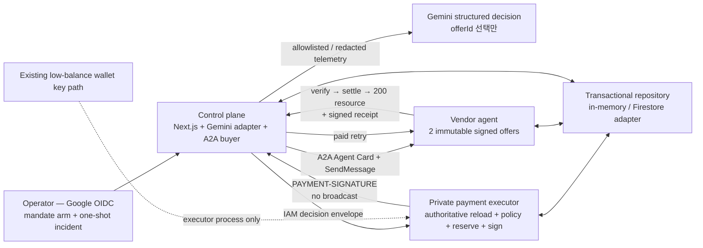
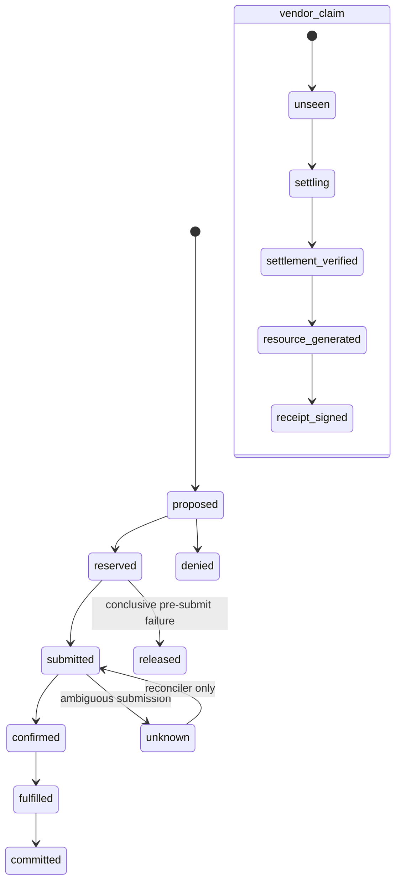

# Uptime402 architecture

이 문서는 **현재 구현된 P0 경계**와 **증거가 아직 필요한 live 목표**를 분리한다. 상태의 최종 기준은 [BUILD_STATUS.md](BUILD_STATUS.md)다.

## 현재 구현된 로컬 경계

로컬 통합 테스트는 official x402 v2 header shape와 SVM signing adapter를 사용하지만 facilitator/chain 결과는 `local-simulated`다. key material은 control-plane/Gemini/browser로 전달되지 않는다.

## P0 live target와 아직 열린 증거

Devnet, Cloud Run, Firestore, raw IAM, live Gemini, public URL과 영상은 해당 evidence가 생성·검증되기 전까지 target이다.

## Trust and identity boundaries

| Boundary | Public | Identity | Secret access | Authoritative responsibility |
|---|---:|---|---|---|
| control-plane | yes | dedicated control SA | outcome signing key + immutable demo-request config | incident orchestration, operator OIDC, redaction, A2A/Gemini inputs, receipt verification, recovery outcome |
| payment-executor | no | dedicated executor SA | existing executor keypair only | mandate/policy reload, integer money math, atomic reserve, x402 payload signing |
| vendor-agent | yes | dedicated vendor SA | vendor offer/receipt key only | immutable offers, 402 challenge, claim/replay, facilitator verify/settle, fulfillment |

P0 admin/executor separation은 별도 admin service가 아니라 operator-authenticated route를 둔 **application role separation**이다. wallet 보장은 **application-enforced policy plus low-balance blast-radius isolation**이며 cryptographic cap이 아니다.

Mission-control live trigger는 Google OAuth Web client ID와 server exact audience가
같을 때만 활성화된다. Browser는 ephemeral ID token만 same-origin Authorization
header로 보내고, incident/policy body는 보내지 않는다. Server는 version-pinned
read-only JSON을 strict parse하며 UI에는 reduced events를 `LIVE UNVERIFIED`로만
반환한다. Hash-pinned `DEVNET VERIFIED` evidence replay와 live execution telemetry는
서로 다른 UI surface이고 promotion verifier 전에는 합쳐지지 않는다.

Live promotion은 세 Cloud Run service description/IAM, executor signer-secret IAM뿐 아니라
project IAM raw export도 exact bytes로 hash-bind한다. Project-level
`roles/run.invoker`/`roles/secretmanager.secretAccessor`와 세 runtime identity의
primitive owner/editor grant가 하나라도 있으면 resource-level allowlist를 우회할 수
있으므로 promotion을 거절한다. Executor의 unauthenticated 401/403도 별도로 확인한다.

## Deterministic pre-sign checks

1. mandate 존재·subject·issuer·attestation·hash·active window·revocation
2. full genesis, `clusterLabel`, CAIP-2 network, SDK network mapping
3. USDC mint/decimals, capability, Agent Card hash, recipient, vendor origin
4. signed offer와 402 challenge authenticity/expiry/binding
5. method, normalized URL, canonical body hash, operationId, request fingerprint
6. redirect disabled, resolved public IP, timeout/content-type/body-size
7. positive integer amount, per-tx/incident/daily budget
8. nonce/paymentId/idempotency replay
9. 402 `extra`의 paymentId/offerId/exact offer hash/request fingerprint/policy hash/fee payer
10. fee payer/fee limit/program/accounts/executor public key
11. signer availability inside the private boundary only

첫 실패에서 deny하고 `transactionCreated:false`, `txSignature:null`을 기록한다.

## Persistence state machines

`settling`/`unknown`은 요청 경로에서 해제하거나 재정산하지 않는다. 같은 paymentId+fingerprint는 저장된 응답을 재생하고, 다른 fingerprint는 409다.

## Canonical bindings

- JSON: RFC 8785, UTF-8.
- Hash: `sha256:<64 lowercase hex>`.
- Devnet full genesis: `EtWTRABZaYq6iMfeYKouRu166VU2xqa1wcaWoxPkrZBG`.
- x402 CAIP-2: `solana:EtWTRABZaYq6iMfeYKouRu166VU2xqa1`.
- USDC mint: `4zMMC9srt5Ri5X14GAgXhaHii3GnPAEERYPJgZJDncDU`, decimals `6`.
- request fingerprint binds method, normalized URL, operationId, canonical body hash, paymentId, scheme, network, mint, base units, payee.
- vendor receipt binds offer/challenge/request/tx/resource/incident; distinct control-plane outcome binds that receipt to a healthy probe.

## P1, not P0 claims

MPP, AP2 conformance, passkey, gasless, BigQuery, KMS, native Fixed Delegation, second vendor deployment, and pay.sh participation stay P1 until their actual protocol/live paths are verified.
