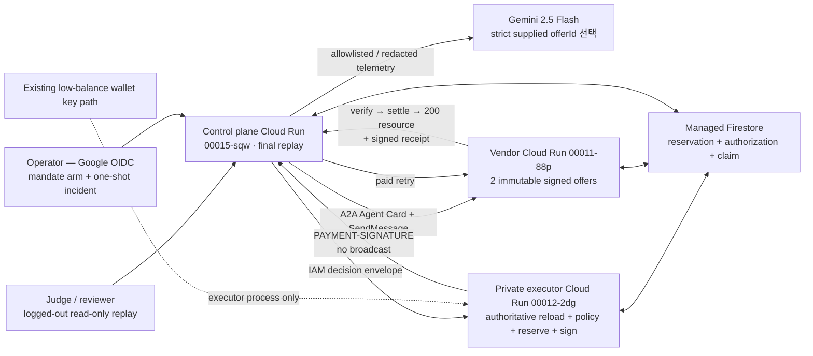
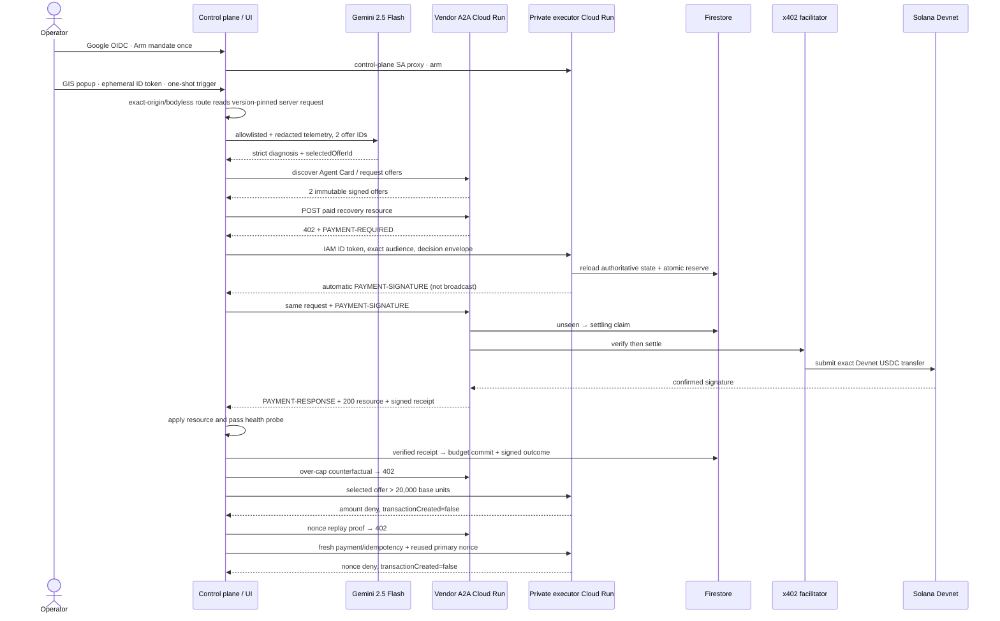
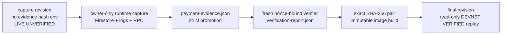
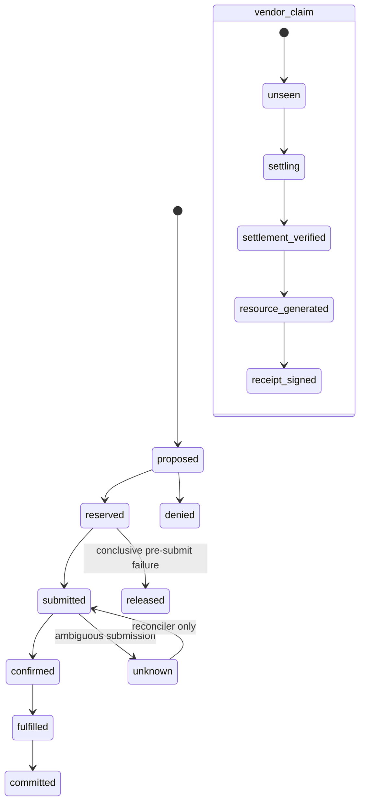

# Uptime402 architecture

이 문서는 **실행 당시 P0 capture 경계**와 **현재 배포된 hash-pinned final evidence stage**를 분리한다. 상태의 최종 기준은 [BUILD_STATUS.md](BUILD_STATUS.md)다. 현재 public UI는 `final / DEVNET VERIFIED` read-only replay이며, 최종 영상이 없으므로 아직 submission-ready는 아니다.

## 현재 구현·배포된 경계

세 Cloud Run final revision은 project `uptime402-hack-260803`, region `asia-northeast3`에서 Ready이며 동일 Git SHA `10ca5f2ccaf2af45e2d80f6065de9c623b24e559` 이미지로 배포돼 100% traffic을 받는다. Owner-only 원본 service/project-IAM exports는 evidence capture 시 SHA-256으로 고정했지만 public repository에서는 operator identity와 runtime configuration 노출을 피하기 위해 제외했다. 공개 가능한 leaf IAM proof와 derived `artifacts/final-release.json` summary만 제공하며, 이는 payment evidence 자체와 구분된다. Demo5는 managed Firestore와 실제 x402 facilitator/Solana Devnet을 사용했다. key material은 control-plane/Gemini/browser로 전달되지 않는다. Public control root는 이 보존 run을 read-only로 렌더링하고 새 결제를 실행하지 않는다.

## Demo5 실제 runtime flow

이 순서로 `finalist-demo-5`가 한 번 실행됐고 paid resource가 health를 `healthy`로 바꿨다. Evidence bundle과 co-sign-aware independent verification report는 검증을 통과했으며, 현재 final control revision은 두 exact hash를 pin해 이 prior run만 `DEVNET VERIFIED`로 렌더링한다. Capture 단계의 reduced telemetry는 `LIVE UNVERIFIED`였고, final replay로 승격된 뒤에도 operator mutation과는 별도 surface로 유지된다.

## Capture에서 final로 가는 단방향 승격

Raw signer-access IAM policy artifact의 안전한 filename 변경 뒤 `artifacts/payment-evidence.json` SHA-256은 `sha256:0a7bfbb00b07ad29d0a74a4d28e5f8d443c94e6bd5034eeb6b7463463b332df4`다. Policy bytes와 bound artifact SHA-256 `sha256:edadb0b47f343f024a871b2482867c6ce9f84c78ab1686041fc01c0710ea56a8`은 바뀌지 않았다. Independent report SHA-256은 `sha256:b147e7cfe2c71fee903f4052ca342d8266343694e48843ae017c8e55ae42cd3e`이고 all 13 checks가 true다. Cloud Build `793d0ada-8859-4ed6-b2ad-bf3a5fd13ee3`의 immutable images에 이 exact pair를 포함해 `final`에 pin했다. Final stage는 evidence file, report file, report→evidence binding, configured hashes 중 하나라도 없거나 다르면 fail closed한다.

## Trust and identity boundaries

| Boundary | Public | Identity | Secret access | Authoritative responsibility |
|---|---:|---|---|---|
| control-plane | yes | dedicated control SA | outcome signing key + immutable demo-request config | incident orchestration, operator OIDC, redaction, A2A/Gemini inputs, receipt verification, recovery outcome |
| payment-executor | no | dedicated executor SA | existing executor keypair only | mandate/policy reload, integer money math, atomic reserve, x402 payload signing |
| vendor-agent | yes | dedicated vendor SA | receipt key + immutable signed-offer catalog | immutable offers, 402 challenge, claim/replay, facilitator verify/settle, fulfillment |

P0 admin/executor separation은 별도 admin service가 아니라 operator-authenticated route를 둔 **application role separation**이다. wallet 보장은 **application-enforced policy plus low-balance blast-radius isolation**이며 cryptographic cap이 아니다.

Mission-control live trigger는 Google OAuth Web client ID와 server exact audience가
같을 때만 인증될 수 있다. Final public root는 login/trigger를 렌더링하지 않고 read-only
evidence replay를 기본으로 제공한다. 보호된 operator route에서 browser는 ephemeral ID token만 same-origin Authorization
header로 보내고, incident/policy body는 보내지 않는다. Server는 version-pinned
read-only JSON을 strict parse하며 UI에는 reduced events를 `LIVE UNVERIFIED`로만
반환한다. Hash-pinned `DEVNET VERIFIED` evidence replay와 live execution telemetry는
서로 다른 UI surface이고 promotion verifier 전에는 합쳐지지 않는다.

Live promotion은 세 Cloud Run service description/IAM, executor signer-secret IAM뿐 아니라
project IAM raw export도 exact bytes로 hash-bind한다. Project-level
`roles/run.invoker`/`roles/secretmanager.secretAccessor`와 세 runtime identity의
primitive owner/editor grant가 하나라도 있으면 resource-level allowlist를 우회할 수
있으므로 promotion을 거절한다. Executor의 unauthenticated 401/403도 별도로 확인한다.

## Deterministic pre-sign checks

1. mandate 존재·subject·issuer·attestation·hash·active window·revocation
2. full genesis, `clusterLabel`, CAIP-2 network, SDK network mapping
3. USDC mint/decimals, capability, Agent Card hash, recipient, vendor origin
4. signed offer와 402 challenge authenticity/expiry/binding
5. method, normalized URL, canonical body hash, operationId, request fingerprint
6. redirect disabled, resolved public IP, timeout/content-type/body-size
7. positive integer amount, per-tx/incident/daily budget
8. nonce/paymentId/idempotency replay
9. 402 `extra`의 paymentId/offerId/exact offer hash/request fingerprint/policy hash/fee payer
10. fee payer/fee limit/program/accounts/executor public key
11. signer availability inside the private boundary only

첫 실패에서 deny하고 `transactionCreated:false`, `txSignature:null`을 기록한다.

## Persistence state machines

`settling`/`unknown`은 요청 경로에서 해제하거나 재정산하지 않는다. 같은 paymentId+fingerprint는 저장된 응답을 재생하고, 다른 fingerprint는 409다.

## Canonical bindings

- JSON: RFC 8785, UTF-8.
- Hash: `sha256:<64 lowercase hex>`.
- Devnet full genesis: `EtWTRABZaYq6iMfeYKouRu166VU2xqa1wcaWoxPkrZBG`.
- x402 CAIP-2: `solana:EtWTRABZaYq6iMfeYKouRu166VU2xqa1`.
- USDC mint: `4zMMC9srt5Ri5X14GAgXhaHii3GnPAEERYPJgZJDncDU`, decimals `6`.
- request fingerprint binds method, normalized URL, operationId, canonical body hash, paymentId, scheme, network, mint, base units, payee.
- vendor receipt binds offer/challenge/request/tx/resource/incident; distinct control-plane outcome binds that receipt to a healthy probe.

For the SVM exact flow, the executor signs the payer slot and returns the x402 payload with the facilitator fee-payer slot intentionally empty. The vendor sends that same paid retry to the facilitator. Settlement may add only the configured fee-payer signature: the serialized message bytes and payer signature must remain identical, the previously empty fee-payer signature must become valid, and no other signer or message mutation is accepted. `signedTransactionSha256` continues to bind the pre-retry payload bytes; RPC verification separately proves the constrained facilitator co-signing.

## Demo5 evidence snapshot — hash-pinned final

| Field | Captured value |
|---|---|
| Incident / payment | `incident-finalist-primary-5` / `payment-finalist-primary-5` |
| Paid offer | `rpc-recovery-standard`, `15000` base units = `0.015 USDC` |
| Transaction | `4P7YWm9Rt7w4MKbRvmfj3sjt5SW1NUfra7xyT9zUMD9uBsby4f3JC8LgYKUFPE1GXN24SoK8ABRx5YSf1HQAKtmZ` |
| Confirmation | `finalized`, slot `480903755` |
| Payer delta | owner `5ZT11…GPHu`, token account `3Xu6…JvQd`, `19970000 -> 19955000`, `-15000` |
| Payee delta | owner `GKW6…odmk`, token account `7XiW…Z74J`, `30000 -> 45000`, `+15000` |
| Gemini materiality | baseline `rpc-recovery-standard`; counterfactual `rpc-recovery-emergency` |
| Over-cap denial | `amount.per_transaction_limit`, `25000 > 20000`, `transactionCreated:false`, `txSignature:null` |
| Replay denial | `identifier.nonce_fresh`, reused `nonce-finalist-primary-5`, fresh payment/idempotency IDs, `transactionCreated:false`, `txSignature:null` |
| Recovery | vendor receipt key `uptime402-vendor-v1`; distinct outcome key `uptime402-outcome-v1`; `statusAfter: healthy` |

The Explorer URL is `https://explorer.solana.com/tx/4P7YWm9Rt7w4MKbRvmfj3sjt5SW1NUfra7xyT9zUMD9uBsby4f3JC8LgYKUFPE1GXN24SoK8ABRx5YSf1HQAKtmZ?cluster=devnet`. These values passed the independent verifier and are now the exact final UI claim. Logged-out desktop/mobile, evidence drawer, IAM/private executor denial, and public endpoints were rechecked; only final video capture/playback/upload remains outside this architecture gate.

## Hackathon recommendation mapping and P1

P0는 해커톤 권장 방향의 Cloud Run + Firestore backbone을 그대로 사용한다. 결제 중 안전성에
필요한 `402 → reserve/sign → paid retry → verify/settle → 200 → receipt/outcome`은 짧고
동기적인 request path와 Firestore state machine으로 먼저 증명했다. GKE는 기간 대비 운영
비용이 크므로 사용하지 않았다.

권장 production 확장인 `Pub/Sub → Eventarc → Workflows → BigQuery` 비동기 audit pipeline은
P1이다. 향후 x402 settlement webhook/event를 비동기로 수신해 reconciliation, Firestore
projection, receipt dispatch, analytics를 분리하되 P0의 signer/IAM/policy boundary는 유지한다.
pay.sh webhook은 live integration이 생긴 경우에만 이 pipeline에 연결하고, AP2 event는
official schema conformance를 통과한 뒤에만 추가한다.

MPP, AP2 conformance, passkey, gasless, BigQuery, Pub/Sub/Eventarc/Workflows, KMS, native
Fixed Delegation, second vendor deployment, and pay.sh participation stay P1 until their actual
protocol/live paths are verified.
