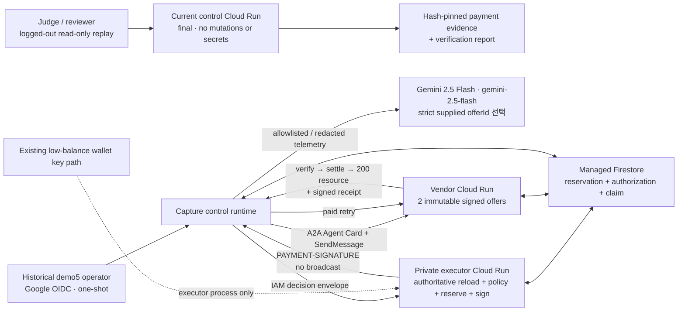
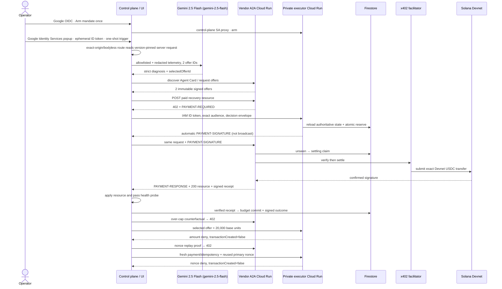
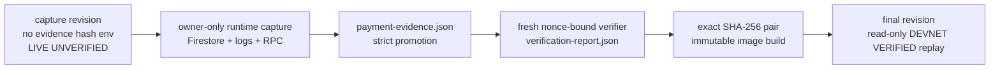
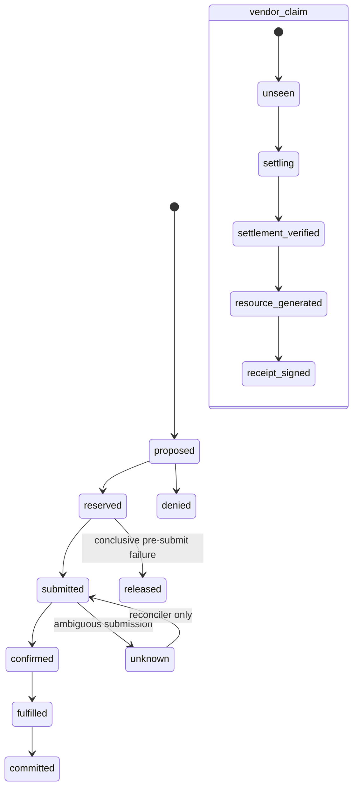

# Uptime402 architecture

이 문서는 **실행 당시 P0 capture 경계**와 **현재 배포된 hash-pinned final evidence stage**를 분리한다. 상태의 최종 기준은 [BUILD_STATUS.md](BUILD_STATUS.md)다. 현재 public UI는 `final / DEVNET VERIFIED` read-only replay이며 새 incident나 결제를 생성하지 않는다.

## 현재 구현·배포된 경계

세 Cloud Run service는 project `uptime402-hack-260803`, region `asia-northeast3`에 존재한다. Demo5를 실행한 capture runtime과 현재 portfolio replay runtime은 같은 것으로 취급하지 않는다. Raw initial promotion은 `artifacts/final-deployment/`와 `artifacts/final-release.json`에 보존된다. 현재 revision, service IAM, Cloud Build는 owner-private raw export로 검증하고, public `artifacts/portfolio-deployment/manifest.json`에는 최소 attestation과 raw SHA-256만 둔다. Current control은 final evidence/report hash와 정적 UI에 필요한 env만 가지며 mutation, OAuth, Firestore, Gemini, executor origin과 Secret Manager mount를 제거한다. Demo5 당시 vendor/executor와 managed Firestore evidence는 변경하지 않는다.

## Demo5 실제 runtime flow

이 순서로 `finalist-demo-5`가 한 번 실행됐고 paid resource의 Firestore 라우트 활성화가 `healthy`로 기록됐다. 당시 probe는 라우트 문서의 무결성과 활성화를 확인했으며 외부 RPC 요청 성공은 측정하지 않았다. Evidence bundle과 co-sign-aware independent verification report는 검증을 통과했으며, 현재 final control revision은 두 exact hash를 pin해 이 prior run만 `DEVNET VERIFIED`로 렌더링한다. Capture 단계의 reduced telemetry는 `LIVE UNVERIFIED`였고, final replay로 승격된 뒤에도 operator mutation과는 별도 surface로 유지된다.

## Capture에서 final로 가는 단방향 승격

Raw signer-access IAM policy artifact의 안전한 filename 변경 뒤 `artifacts/payment-evidence.json` SHA-256은 `sha256:0a7bfbb00b07ad29d0a74a4d28e5f8d443c94e6bd5034eeb6b7463463b332df4`다. Policy bytes와 bound artifact SHA-256 `sha256:edadb0b47f343f024a871b2482867c6ce9f84c78ab1686041fc01c0710ea56a8`은 바뀌지 않았다. Independent report SHA-256은 `sha256:b147e7cfe2c71fee903f4052ca342d8266343694e48843ae017c8e55ae42cd3e`이고 all 13 checks가 true다. Initial promotion과 현재 portfolio Cloud Build의 raw output/digest는 각 deployment artifact가 별도로 보존한다. Final stage는 evidence file, report file, report→evidence binding, configured hashes 중 하나라도 없거나 다르면 fail closed한다.

## Trust and identity boundaries

| Boundary | Public | Identity | Secret access | Authoritative responsibility |
|---|---:|---|---|---|
| current control replay | yes | dedicated control SA | none | exact hash-pinned evidence replay; every mutation route fails closed |
| historical capture control | yes | same dedicated control SA | outcome key + immutable demo request/mandate | incident orchestration, operator OIDC, redaction, A2A/Gemini inputs, receipt verification, recovery outcome |
| payment-executor | no | dedicated executor SA | existing executor keypair only | mandate/policy reload, integer money math, atomic reserve, x402 payload signing |
| vendor-agent | yes | dedicated vendor SA | receipt key + immutable signed-offer catalog | immutable offers, 402 challenge, claim/replay, facilitator verify/settle, fulfillment |

P0 admin/executor separation은 별도 admin service가 아니라 operator-authenticated route를 둔 **application role separation**이다. wallet 보장은 **application-enforced policy plus low-balance blast-radius isolation**이며 cryptographic cap이 아니다.

Capture 당시 mission-control trigger는 Google OAuth Web client ID와 exact audience를
검증했고 browser는 ephemeral ID token만 same-origin Authorization header로 전송했다.
현재 final public root는 별도 replay template을 사용해 login/trigger뿐 아니라 operator,
Firestore, Gemini, executor와 signing 설정 자체를 배포하지 않는다. Mutation route는 인증
시도보다 먼저 `404 operator_mutations_disabled`로 종료된다. Hash-pinned `DEVNET VERIFIED`
replay와 과거 capture telemetry는 서로 다른 runtime 및 evidence 계층이다.

Live promotion은 세 Cloud Run service description/IAM, executor signer-secret IAM뿐 아니라
project IAM raw export도 exact bytes로 hash-bind한다. Project-level
`roles/run.invoker`/`roles/secretmanager.secretAccessor`와 세 runtime identity의
primitive owner/editor grant가 하나라도 있으면 resource-level allowlist를 우회할 수
있으므로 promotion을 거절한다. Executor의 unauthenticated 401/403도 별도로 확인한다.

## Deterministic pre-sign checks

1. mandate 존재·subject·issuer·attestation·hash·active window·revocation
2. full genesis, `clusterLabel`, CAIP-2 network, SDK network mapping
3. USDC mint/decimals, capability, Agent Card hash, recipient, vendor origin
4. signed offer와 402 challenge authenticity/expiry/binding
5. method, normalized URL, canonical body hash, operationId, request fingerprint
6. redirect disabled, resolved public IP, timeout/content-type/body-size
7. positive integer amount, per-tx/incident/daily budget
8. nonce/paymentId/idempotency replay
9. 402 `extra`의 paymentId/offerId/exact offer hash/request fingerprint/policy hash/fee payer
10. fee payer/fee limit/program/accounts/executor public key
11. signer availability inside the private boundary only

첫 실패에서 deny하고 `transactionCreated:false`, `txSignature:null`을 기록한다.

## Persistence state machines

`settling`/`unknown`은 요청 경로에서 해제하거나 재정산하지 않는다. 같은 paymentId+fingerprint는 저장된 응답을 재생하고, 다른 fingerprint는 409다.

## Canonical bindings

- JSON: RFC 8785, UTF-8.
- Hash: `sha256:<64 lowercase hex>`.
- Devnet full genesis: `EtWTRABZaYq6iMfeYKouRu166VU2xqa1wcaWoxPkrZBG`.
- x402 CAIP-2: `solana:EtWTRABZaYq6iMfeYKouRu166VU2xqa1`.
- USDC mint: `4zMMC9srt5Ri5X14GAgXhaHii3GnPAEERYPJgZJDncDU`, decimals `6`.
- request fingerprint binds method, normalized URL, operationId, canonical body hash, paymentId, scheme, network, mint, base units, payee.
- vendor receipt binds offer/challenge/request/tx/resource/incident; distinct control-plane outcome binds that receipt to a healthy probe.

For the SVM exact flow, the executor signs the payer slot and returns the x402 payload with the facilitator fee-payer slot intentionally empty. The vendor sends that same paid retry to the facilitator. Settlement may add only the configured fee-payer signature: the serialized message bytes and payer signature must remain identical, the previously empty fee-payer signature must become valid, and no other signer or message mutation is accepted. `signedTransactionSha256` continues to bind the pre-retry payload bytes; RPC verification separately proves the constrained facilitator co-signing.

## Demo5 evidence snapshot — hash-pinned final

| Field | Captured value |
|---|---|
| Incident / payment | `incident-finalist-primary-5` / `payment-finalist-primary-5` |
| Paid offer | `rpc-recovery-standard`, `15000` base units = `0.015 USDC` |
| Transaction | `4P7YWm9Rt7w4MKbRvmfj3sjt5SW1NUfra7xyT9zUMD9uBsby4f3JC8LgYKUFPE1GXN24SoK8ABRx5YSf1HQAKtmZ` |
| Confirmation | `finalized`, slot `480903755` |
| Payer delta | owner `5ZT11…GPHu`, token account `3Xu6…JvQd`, `19970000 -> 19955000`, `-15000` |
| Payee delta | owner `GKW6…odmk`, token account `7XiW…Z74J`, `30000 -> 45000`, `+15000` |
| Gemini materiality | baseline `rpc-recovery-standard`; counterfactual `rpc-recovery-emergency` |
| Over-cap denial | `amount.per_transaction_limit`, `25000 > 20000`, `transactionCreated:false`, `txSignature:null` |
| Replay denial | `identifier.nonce_fresh`, reused `nonce-finalist-primary-5`, fresh payment/idempotency IDs, `transactionCreated:false`, `txSignature:null` |
| Recovery | vendor receipt key `uptime402-vendor-v1`; distinct outcome key `uptime402-outcome-v1`; `statusAfter: healthy` |

The Explorer URL is `https://explorer.solana.com/tx/4P7YWm9Rt7w4MKbRvmfj3sjt5SW1NUfra7xyT9zUMD9uBsby4f3JC8LgYKUFPE1GXN24SoK8ABRx5YSf1HQAKtmZ?cluster=devnet`. These values passed the independent verifier and are now the exact final UI claim. Logged-out desktop/mobile, evidence drawer, IAM/private executor denial, and public endpoints were rechecked. The 165-second final walkthrough is published at `https://www.youtube.com/watch?v=jwJRfs-NRZY`; its local source remains intentionally untracked.

## Hackathon recommendation mapping and P1

P0는 해커톤 권장 방향의 Cloud Run + Firestore backbone을 그대로 사용한다. 결제 중 안전성에
필요한 `402 → reserve/sign → paid retry → verify/settle → 200 → receipt/outcome`은 짧고
동기적인 request path와 Firestore state machine으로 먼저 증명했다. GKE는 기간 대비 운영
비용이 크므로 사용하지 않았다.

권장 production 확장인 `Pub/Sub → Eventarc → Workflows → BigQuery` 비동기 audit pipeline은
P1이다. 향후 x402 settlement webhook/event를 비동기로 수신해 reconciliation, Firestore
projection, receipt dispatch, analytics를 분리하되 P0의 signer/IAM/policy boundary는 유지한다.
pay.sh webhook은 live integration이 생긴 경우에만 이 pipeline에 연결하고, AP2 event는
official schema conformance를 통과한 뒤에만 추가한다.

MPP, AP2 conformance, passkey, gasless, BigQuery, Pub/Sub/Eventarc/Workflows, KMS, native
Fixed Delegation, second vendor deployment, and pay.sh participation stay P1 until their actual
protocol/live paths are verified.

## 2026-09-05 개선

결제 흐름을 계약 정의(contracts), 실행 제어(orchestration), 검증(verification), 마무리 처리(finalization)로 분리했다. 결제 실행기의 예산 증거는 예약 트랜잭션이 실제 사용한 전후 잔액으로 계산한다.

공급자의 영수증을 확인하면 비공개 Firestore 체크포인트에 검증 입력을 저장한다. 라우트 적용과 상태 검사 후에는 서명된 증거와 원래 이벤트 시각을 저장하고, 예산 사용 확정 후에는 최종 결과와 감사 이벤트를 저장한다. 실패 시 `post_settlement_incomplete` 또는 `audit_pending`을 반환하며, 비공개 `incident:resume` 명령으로 남은 단계를 재개한다. 재개할 때는 견적 조회, Gemini 호출, 결제 승인 요청, 결제 재요청, 정산을 반복하지 않는다. 체크포인트 저장 전에 프로세스가 종료되거나 저장 자체가 실패하면 이 경로로 자동 재개할 수 없다. 그 경우 공급자의 기존 거래 상태와 비공개 감사 기록을 확인해야 한다.

체크포인트에는 결제자의 서명 키가 없지만 이미 발급된 결제 승인 데이터와 리소스 응답이 있으므로 공개 자료로 내보내지 않는다. 컬렉션에는 기존 비공개 Firestore IAM 권한을 적용하며 원본 데이터 대신 정제된 장애 신호만 저장한다. 먼저 저장한 체크포인트를 덮어쓰지 않고 기존 실행 맥락과 충돌하는 저장 요청은 거절한다.

새 증거 수집 실행의 dependency-health는 라우트 문서를 검증한 뒤, 운영자가 `RECOVERY_RPC_ROUTES_JSON`에 연결해 둔 견적과 리소스 URL에 해당하는 RPC로 `getHealth`와 `getGenesisHash`를 호출한다. Devnet 성공 응답, 엔드포인트와 응답의 해시, 응답 시간, 관측 시각을 증거에 넣는다. 설정 누락, 연결 정보 불일치, HTTP/RPC 실패, 다른 genesis는 성공으로 판정하지 않는다. 로컬 어댑터와 Firestore 에뮬레이터로 검증했으며 새로 구매할 엔드포인트에서의 실제 동작은 아직 검증하지 않았다.

공개 재생 화면은 증거와 검증 보고서의 해시, 파일 상태를 키로 사용해 검증에 성공한 결과를 최대 4개 캐시한다. 검증 도중 파일이 바뀌면 거절하고, 실패 결과는 캐시하지 않는다. 상세 증거 컴포넌트는 사용자가 펼칠 때 불러온다. 화면의 9.340초는 판단 기록부터 라우트 활성화 확인까지의 시간이다. 당시의 라우트 활성화 증거와 새 RPC 검사의 검증 범위는 구분한다.
